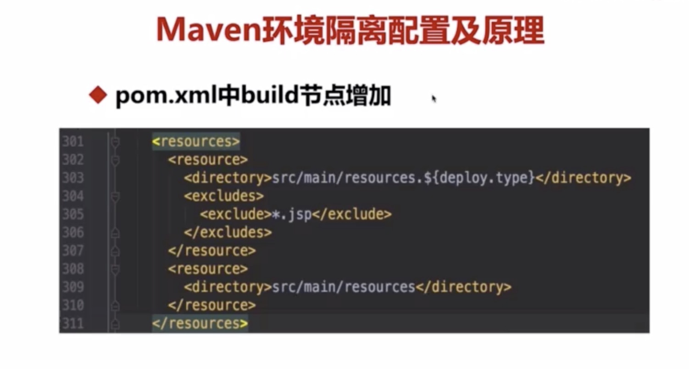
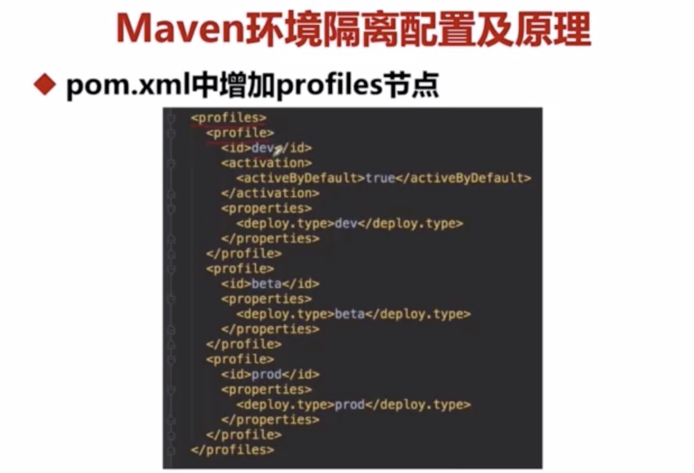
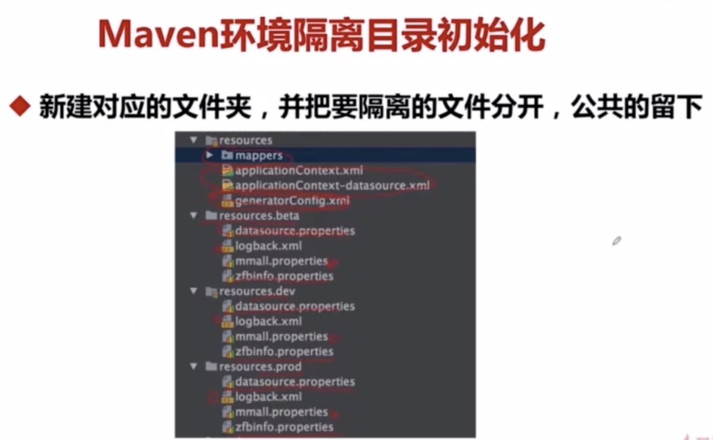
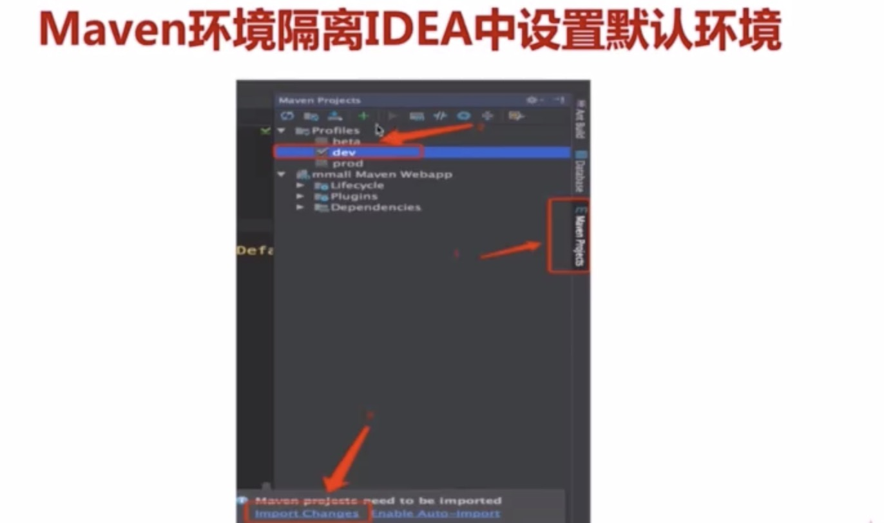

[TOC]


### 慕课网电商网站学习记录

---

#### 课程导学

- maven环境隔离

- redis+cookie+jackjson+filter 原生解决集群session的问题

- spring session解决集群session的问题

- redis的强化

- redis分布式，分布式锁

- consistent cache分布式算法

- redis构建session服务器

- redis+cookie+jackson+filter实现单点登录

- spring session实现单点登录

- spring schedule+redissession实现分布式锁

- multi-process debug

- iterm2联动操作多窗口命令行

- 数据库主从读写分离

- 数据库表水平拆分

  

  

#### maven环境隔离

概念：使用ssm框架，mavne构建隔离环境之间各种配置存在的差异，springboot则可以直接通过指定配置环境参数后缀进行隔离，然后在配置文件指定激活的环境或是在启动参数中手动输入需要启动的环境

- 本地开发环境-local
- 开发环境-dev
- 测试环境-beta
- 生产环境-prod

##### maven环境隔离的配置主要为以下四步









##### maven环境隔离编辑打包命令

参数是 -P{环境标识}

例如使用开发环境命令为：mvn clean package -Dmaven.test.skip=true -Pdev

#### Tomcat集群演进及搭建

> 使用集群的好处

- 提高服务的性能，并发能力，以及高可用性
- 提高项目架构的横向扩展能力

> Tomcat集群实现原理

- 通过Nginx负载均衡来转发到不同的Tomcat服务器

> Tomcat集群带来了什么新问题

- sesson登录信息存储及读取的问题
- 服务器定时任务并发的问题

> 解决方案

- 采用nginx ip hash policy(使用的少)
  - 优点：可以不改变现有技术架构，直接横向扩展
  - 缺点：1.导致服务器负载均衡不平均 2.在ip变化的环境下无法作用

##### Tomcat单机部署多应用

此例以配置两个Tomcat为例（Mac版）：

1、下载apache-tomcat-7.0.75，下载下来的文件为apache-tomcat-7.0.75.tar.gz

2、解压到，分别为 /usr/tomcat1，/usr/tomcat2

3、增加环境变量：vim /etc/profile（Windows在环境变量，系统变量里增加）

```shell
export CATALINA_BASE=/usr/tomcat1
export CATALINA_HOME=/usr/tomcat1
export TOMCAT_HOME=/usr/tomcat1
export CATALINA_2_BASE=/usr/tomca2
export CATALINA_2_HOME=/usr/tomcat2
export TOMCAT_2_HOME=/usr/tomcat2
```

（注：修改完后，source /etc/profile， 使配置文件立即生效）

以下修改都是针对tomcat2，tomcat1 不变

4、修改catalina.sh （Windows是修改catalina.bat）

在 # OS specific support. $var _must_ be set to either true or false  节点下添加： 

```shell
export CATALINA_BASE=$CATALINA_2_BASE
export CATALINA_HOME=$CATALINA_2_HOME
```

如果不添加，就默认的是CATALINA_BASE和CATALINA_HOME，即是tomcat1的位置

（注：vim中搜索命令：   /OS  从上往下搜， ?bin  从下往上搜 ）

附Windows修改：将startup.bat和catalina.bat中的CATALINA_BASE全部替换为CATALINA_2_BASE，CATALINA_HOME全部替换为CATALINA_2_HOME，后续相同。

5、修改conf文件夹下的server.xml （加粗的表示修改的或新加的）

- Server port节点端口号修改(8080改成9080)
- Connector poor=”8080“  protocal="HTTP/1.1"端口修改（8080改成9080）
- Connector port="8080" protocal="Ajp/1.3"(8080改成9080)


6、启动tomcat，进入bin目录，执行./startup.sh，分别启动2个Tomcat，然后在浏览器中输入：
http://localhost:8080
http://localhost:9080 

#### Nginx常用策略，场景及特点

1.轮询（默认）
		优点：实现简单
		缺点：不考虑每台服务器处理能力
		配置
			Upstream 域名{ 
				Server 域名:8080;
				Server 域名:9080;
			}
	2.权重
		优点：考虑了每台服务器处理能力的不同
		配置
			Upstream 域名{ 
				Server 域名:8080 weight = 15;
				Server 域名:9080 weight = 10;
			}
	3.ip hash
		优点：能实现同一个用户访问同一个服务器
		缺点：根据ip hash 不一定平均
		配置
			Upstream 域名{ 
				Ip_hash;
				Server 域名:8080;
				Server 域名:9080;
			}
	4.url hash（第三方）
		优点：能实现同一个服务访问同一个服务器
		缺点：根据url hash分配请求会不平均，请求频繁的URL会请求到同一个服务器上
		配置
			Upstream 域名{ 
				Server 域名:8080;
				Server 域名:9080;
				Hash $request_uri;
			}

 	5.  fair（第三方）
    特点：按后端服务器的相应时间来分配请求，响应时间短的优先分配
    	配置：
    		Upstream 域名{ 
    			Server 域名:8080;
    			Server 域名:9080;
    			Fair;
    		}

负载均衡参数扩展

Upstream backserver{ 
	Ip_hash;
	Server 127.0.0.1:9090 down;(down表示当前的server暂时不参与负载均衡）
	Server 127.0.0.1：8080 weight = 2；(weight默认为1，weight越大，负载的权重就越大)
	Server 127.0.0.1：6060；
	Server 127.0.0.1：7070 backup；（其他所有的非backup机器down或者忙的时候，请求backup机器
	}

推荐博文：

- [[详解 nginx location ~ ](https://www.cnblogs.com/feiyuanxing/p/4668818.html)]

#### Nginx+Tomcat搭建集群

> 大概步骤如下

- 下载两个tomcat修改其中一台端口号
- 下载Nginx，修改其配置文件conf

推荐博文：

[Nginx+Tomcat搭建集群](https://blog.csdn.net/wang379275614/article/details/47778201)

#### redis+cookie+jackson+filter实现单点登录

> 什么是单点登录？单点登录全称Single Sign On（以下简称SSO），是指在多系统应用群中登录一个系统，便可在其他所有系统中得到授权而无需再次登录，包括单点登录与单点注销两部分

推荐博文：

[Redis+Jackson+Cookie+Filter原生实现单点登录](https://blog.csdn.net/sinat_25295611/article/details/80406172)

####spring session实现单点登录

> 以下第一篇推荐博文的实现方式为ssm框架的实现方式，相对于springboot的就较为复杂，不过优点在于通过这种方式能够更清楚springsession实现的内部原理,第二篇则是sprigboot的实现方式，相对而言就简单多了，毕竟springboot提倡快速开发，开箱即用，我们只需要简单的配置就可以了

推荐博文：

- [Redis+Spring Session 实现分布式Session](https://blog.csdn.net/sinat_25295611/article/details/80446506)
- [spring-boot+spring-session集成](https://yq.aliyun.com/articles/182676?utm_content=m_29523)

#### Redis分布式锁原理解析

推荐博文：

- [Redis分布式锁原理解析](<https://blog.csdn.net/andy86869/article/details/81668355>)
- [Redis防死锁流程](<https://blog.csdn.net/liyuhui195134/article/details/81366165>)

#### Redisson分布式锁构建集群模式任务调度

推荐博文：

- [Redisson框架及项目集成](https://blog.csdn.net/qq_34908838/article/details/81838640)

- [集群模式下的定时任务与Redis分布式锁](https://blog.csdn.net/sinat_25295611/article/details/80420086)

- [SpringBoot集成redisson(单机,集群,哨兵)](<https://www.jianshu.com/p/2b19dec72ab0>)

