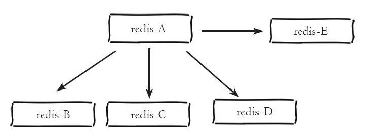
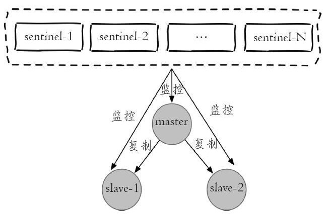

###Redis主从及哨兵模式

redis作为一种高效的缓存框架，使用是非常广泛的，在数据存储上，在运行时其将数据存储在内存中，以实现数据的高效读写，并且根据定制的持久化规则不同，其会不定期的将数据持久化到硬盘中。另外相较于其他的NoSql数据库，redis提供了非常丰富的数据结构，如dict，sds，linkedlist，ziplist，set，quicklist，geometry。在这些存储结构的基础上，redis为用户提供了非常丰富的操作选择，如通过zskiplist来达到对某种类型的数据的排序目的，而排序在数据库中是一个非常耗时的操作。

**1.redis单例的安装和使用**

​      redis相对于其他的缓存框架安装非常的方便，只需要从<https://redis.io/download>下载后解压，进入redis目录之后执行如下命令即安装完成：

```
make install
```

这里需要注意的是make是gcc中的一个命令，安装之前请确保机器安装了gcc。redis中所有的命令都在redis安装目录中的src子目录下，其中比较重要的是redis-server，redis-sentinel，redis-cli。

​      编译完成之后在src目录下执行./redis-server启动redis（启动后可关闭该窗口），然后新开一个窗口，在命令行中执行./redis-cli即可连接启动的redis服务。在其中执行如下命令即可看到编译安装成功了：

```
127.0.0.1:6379> set hello world
OK
127.0.0.1:6379> get hello
"world"
```

​      这里需要说明的是，按照上述方式启动redis，其使用的ip为本机ip 127.0.0.1，端口为6379，并且其余的配置采用的都是默认配置，相关配置可在redis安装目录下的redis.conf文件中查看。如果需要按照指定的配置文件来启动，可在redis-server后接上配置文件名，如：

```
./src/redis-server redis.conf
```

另外，上述使用redis-cli连接redis客户端时如果不带任何参数，那么其连接的默认ip和端口为127.0.0.1:6379。如果需要连接指定ip和端口的客户端，可以使用如下方式：

```
./src/redis-cli -h 127.0.0.1 -p 6379
```

这里-h参数表示连接的ip，-p则表示连接的端口。

​      配置好redis之后，我们就可以在redis中执行相关命令来操作数据，关于redis的常用命令，可查看本人的另一篇博客《redis常用命令大全》，其中有比较详细的讲解。

**2.redis主从模式的配置**

​      redis单例提供了一种数据缓存方式和丰富的数据操作api，但是将数据完全存储在单个redis中主要存在两个问题：数据备份和数据体量较大造成的性能降低。这里redis的主从模式为这两个问题提供了一个较好的解决方案。主从模式指的是使用一个redis实例作为主机，其余的实例作为备份机。主机和从机的数据完全一致，主机支持数据的写入和读取等各项操作，而从机则只支持与主机数据的同步和读取，也就是说，客户端可以将数据写入到主机，由主机自动将数据的写入操作同步到从机。主从模式很好的解决了数据备份问题，并且由于主从服务数据几乎是一致的，因而可以将写入数据的命令发送给主机执行，而读取数据的命令发送给不同的从机执行，从而达到读写分离的目的。如下所示主机redis-A分别有redis-B、redis-C、redis-D、redis-E四个从机



前面第1点中我们已经介绍了redis单例的配置方式，而上面我们也介绍了主从模式其实也是多个redis实例组成的，因而redis主从模式的配置可以理解为多个不同的redis实例通过一定的配置告知其相互之间的主从关系。而前面已经介绍，每个redis实例都会占用一个本机的端口号，主从模式的配置主要的配置点有两个：当前实例端口号和当前实例是主机还是从机，是从机的话其主机的ip和端口是什么。一般的redis目录下的redis.conf保存的是默认配置，尽量不要对其进行修改，这里我们复制三份redis.conf文件，分别命名为6379.conf，6380.conf和6381.conf，如下是端口为6379的主机的主要配置：

```
bind 127.0.0.1
port 6379
logfile "6379.log"
dbfilename "dump-6379.rdb"
```

如下是端口为6380和6381的从机的配置：

```
bind 127.0.0.1
port 6380
logfile "6380.log"
dbfilename "dump-6380.rdb"
slaveof 127.0.0.1 6379
bind 127.0.0.1
port 6381
logfile "6381.log"
dbfilename "dump-6381.rdb"
slaveof 127.0.0.1 6379
```

​      可以看到，端口为6380和6381的实例被配置为端口为6379的实例的从机。配置完成后使用redis-server分别执行如下命令启动三个实例：

```
./src/redis-server 6379.conf
./src/redis-server 6380.conf
./src/redis-server 6381.conf
```

启动之后分别开启开启三个命令行工具分别执行以下命令连接redis实例：

```
./src/redis-cli -p 6379
./src/redis-cli -p 6380
./src/redis-cli -p 6381
```

分别在三个命令行工具中执行一个get命令，获取键名为msg的数据，如下所示：

```
127.0.0.1:6379> get msg
(nil)
127.0.0.1:6380> get msg
(nil)
127.0.0.1:6381> get msg
(nil)
```

可以看到，在三个redis实例中都不存在键为msg的数据，现在我们在主机6379上设置一个键为msg的数据，如下所示：

```
127.0.0.1:6379> set msg "hello"
OK
```

可以看到设置成功了，此时我们在6380和6381的实例上执行get msg的命令，如下所示：

```
127.0.0.1:6380> get msg
"hello"
127.0.0.1:6381> get msg
"hello"
```

可以看到，虽然我们只是在6379的实例上设置了msg这条数据，但是在6380和6381的实例上也存有了相应的数据，说明我们成功配置了redis的主从模式。另外，如果不在配置文件中指定主从节点的关系，也可以在启动相关redis实例之后使用slaveof命令来指定当前节点称为某个节点的从节点，如：

```
127.0.0.1:6380> slaveof 127.0.0.1 6379
```

**3.redis中sentinel配置**

​      redis主从模式解决了数据备份和单例可能存在的性能问题，但是其也引入了新的问题。由于主从模式配置了三个redis实例，并且每个实例都使用不同的ip（如果在不同的机器上）和端口号，根据前面所述，主从模式下可以将读写操作分配给不同的实例进行从而达到提高系统吞吐量的目的，但也正是因为这种方式造成了使用上的不便，因为每个客户端连接redis实例的时候都是指定了ip和端口号的，如果所连接的redis实例因为故障下线了，而主从模式也没有提供一定的手段通知客户端另外可连接的客户端地址，因而需要手动更改客户端配置重新连接。另外，主从模式下，如果主节点由于故障下线了，那么从节点因为没有主节点而同步中断，因而需要人工进行故障转移工作。

​      为了解决这两个问题，在2.8版本之后redis正式提供了sentinel（哨兵）架构。关于sentinel，这里需要说明几个概念：

| 名词             | 逻辑结构                   | 物理结构                   |
| ---------------- | -------------------------- | -------------------------- |
| 主节点           | redis主服务/数据库         | 一个独立的redis进程        |
| 从节点           | redis从服务/数据库         | 一个独立的redis进程        |
| sentinel节点     | 监控redis数据节点          | 一个独立的sentinel进程     |
| sentinel节点集合 | 若干sentinel节点的抽象集合 | 若干sentinel节点进程       |
| 应用方           | 泛指一个或多个客户端       | 一个或多个客户端线程或进程 |

​      每个sentinel节点其实就是一个redis实例，与主从节点不同的是sentinel节点作用是用于监控redis数据节点的，而sentinel节点集合则表示监控一组主从redis实例多个sentinel监控节点的集合，比如有主节点master和从节点slave-1、slave-2，为了监控这三个主从节点，这里配置N个sentinel节点sentinel-1，sentinel-2，...，sentinel-N。如下图是sentinel监控主从节点的示例图：



 从图中可以看出，对于一组主从节点，sentinel只是在其外部额外添加的一组用于监控作用的redis实例。在主从节点和sentinel节点集合配置好之后，sentinel节点之间会相互发送消息，以检测其余sentinel节点是否正常工作，并且sentinel节点也会向主从节点发送消息，以检测监控的主从节点是否正常工作。。前面讲到，sentinel架构的主要作用是解决主从模式下主节点的故障转移工作的。这里如果主节点因为故障下线，那么某个sentinel节点发送检测消息给主节点时，如果在指定时间内收不到回复，那么该sentinel就会主观的判断该主节点已经下线，那么其会发送消息给其余的sentinel节点，询问其是否“认为”该主节点已下线，其余的sentinel收到消息后也会发送检测消息给主节点，如果其认为该主节点已经下线，那么其会回复向其询问的sentinel节点，告知其也认为主节点已经下线，当该sentinel节点最先收到超过指定数目（配置文件中配置的数目和当前sentinel节点集合数的一半，这里两个数目的较大值）的sentinel节点回复说当前主节点已下线，那么其就会对主节点进行故障转移工作，故障转移的基本思路是在从节点中选取某个从节点向其发送slaveof no one（假设选取的从节点为127.0.0.1:6380），使其称为独立的节点（也就是新的主节点），然后sentinel向其余的从节点发送slaveof 127.0.0.1 6380命令使它们重新成为新的主节点的从节点。重新分配之后sentinel节点集合还会继续监控已经下线的主节点（假设为127.0.0.1:6379），如果其重新上线，那么sentinel会向其发送slaveof命令，使其成为新的主机点的从节点，如此故障转移工作完成。

​      上面我们讲到了，每个sentinel节点在本质上还是一个redis实例，只不过和redis数据节点不同的是，其主要作用是监控redis数据节点。在redis安装目录下有个默认的sentinel配置文件sentinel.conf，和配置主从节点类似，这里复制三个配置文件：sentinel-26379.conf，sentinel-26380.conf和sentinel-26381.conf。分别按照如下示例编辑这三个配置文件：

```
port 26379  
daemonize yes  
logfile "26379.log"  
dir /opt/soft/redis/data  
sentinel monitor mymaster 127.0.0.1 6379 2
sentinel down-after-milliseconds mymaster 30000  
sentinel parallel-syncs mymaster 1  
sentinel failover-timeout mymaster 180000
sentinel myid mm55d2d712b1f3f312b637f9b546f00cdcedc787
```

对于端口为26380和26381的sentinel，其配置和上述类似，只需要把相应的端口号修改为对应的端口号即可。这里注意两点：①每个sentinel的myid参数也要进行修改，因为sentinel之间是通过该属性来唯一区分其他sentinel节点的；②参数中sentinel monitor mymaster 127.0.0.1 6379 2这里的端口号6379是不用更改的，因为sentinel是通过检测主节点的状态来得知当前主节点的从节点有哪些的，因而设置为主节点的端口号即可。配置完成后我们首先启动三个主从节点，然后分别使用三个配置文件使用如下命令启用sentinel：

```
./src/redis-sentinel sentinel-26379.conf
./src/redis-sentinel sentinel-26380.conf
./src/redis-sentinel sentinel-26381.conf
```

由于sentinel节点也是一个redis实例，因而我们可以通过如下命令使用redis-cli连接sentinel节点：

```
./src/redis-cli -p 26379
```

连上sentinel节点之后我们可以通过如下命令查看sentinel状态：

```
127.0.0.1:26379> info sentinel
```

结果如下：

```
# Sentinel
sentinel_masters:1
sentinel_tilt:0
sentinel_running_scripts:0
sentinel_scripts_queue_length:0
sentinel_simulate_failure_flags:0
master0:name=mymaster,status=ok,address=127.0.0.1:6379,slaves=2,sentinels=3
```

可以看到，sentinel检测到主从节点总共有三个，其中一个主节点，两个从节点，并且sentinel节点总共也有三个。启动完成之后，我们可以通过主动下线主节点来模拟sentinel的故障转移过程。首先我们连接上端口为6379的主节点，使用如下命令查看主从节点状态：

```
127.0.0.1:6379> info replication
```

结果如下：

```
# Replication
role:master
connected_slaves:2
slave0:ip=127.0.0.1,port=6380,state=online,offset=45616,lag=1
slave1:ip=127.0.0.1,port=6381,state=online,offset=45616,lag=1
master_repl_offset:45616
repl_backlog_active:1
repl_backlog_size:1048576
repl_backlog_first_byte_offset:2
repl_backlog_histlen:45615
```

可以看到，当前主节点有两个从节点，端口分别为6380和6381。然后我们对主节点执行如下命令：

```
127.0.0.1:6379> shutdown save
```

然后我们连接上端口号为6380的从节点，并执行如下命令：

```
127.0.0.1:6380> info replication 
```

结果如下：

```
# Replication
role:master
connected_slaves:1
slave0:ip=127.0.0.1,port=6381,state=online,offset=12344,lag=0
master_repl_offset:12477
repl_backlog_active:1
repl_backlog_size:1048576
repl_backlog_first_byte_offset:2
repl_backlog_histlen:12476
```

可以看到，当端口为6379的实例下线之后，端口为6380的实例被重新竞选为新的主节点，并且端口为6381的实例被设置为6380的实例的从节点。如果我们此时重新启用端口为6379的节点，然后再查看主从状态，结果如下：

```
# Replication
role:master
connected_slaves:2
slave0:ip=127.0.0.1,port=6381,state=online,offset=59918,lag=0
slave1:ip=127.0.0.1,port=6379,state=online,offset=59918,lag=1
master_repl_offset:60051
repl_backlog_active:1
repl_backlog_size:1048576
repl_backlog_first_byte_offset:2
repl_backlog_histlen:60050
```

可以看到，端口为6379的redis实例重新连接后，sentinel节点检测到其重新连接，那么对其发送命令，使其成为新的主节点的从节点。

**4.redis集群的配置**

​      redis集群是在redis 3.0版本推出的一个功能，其有效的解决了redis在分布式方面的需求。当遇到单机内存，并发和流量瓶颈等问题时，可采用Cluster方案达到负载均衡的目的。并且从另一方面讲，redis中sentinel有效的解决了故障转移的问题，也解决了主节点下线客户端无法识别新的可用节点的问题，但是如果是从节点下线了，sentinel是不会对其进行故障转移的，并且连接从节点的客户端也无法获取到新的可用从节点，而这些问题在Cluster中都得到了有效的解决。

​      redis集群中数据是和槽（slot）挂钩的，其总共定义了16384个槽，所有的数据根据一致哈希算法会被映射到这16384个槽中的某个槽中；另一方面，这16384个槽是按照设置被分配到不同的redis节点上的，比如启动了三个redis实例：cluster-A，cluster-B和cluster-C，这里将0-5460号槽分配给cluster-A，将5461-10922号槽分配给cluster-B，将10923-16383号槽分配给cluster-C（总共有16384个槽，但是其标号类似数组下标，是从0到16383）。也就是说数据的存储只和槽有关，并且槽的数量是一定的，由于一致hash算法是一定的，因而将这16384个槽分配给无论多少个redis实例，对于确认的数据其都将被分配到确定的槽位上。redis集群通过这种方式来达到redis的高效和高可用性目的。

​      这里需要进行说明的一点是，一致哈希算法根据数据的key值计算映射位置时和所使用的节点数量有非常大的关系。一致哈希分区的实现思路是为系统中每个节点分配一个token，范围一般在0~2^32，这些token构成一个哈希环，数据读写执行节点查找操作时，先根据key计算hash值，然后顺时针找到第一个大于等于该hash值的token节点，需要操作的数据就保存在该节点上。通过分析可以发现，一致哈希分区存在如下问题：

1. 加减节点会造成哈希环中部分数据无法命中，需要手动处理或忽略这部分数据；
2. 当使用少量节点时，节点变化将大范围影响环中数据映射，因此这种方式不适合少量节点的分布式方案；
3. 普通的一致性哈希分区在增减节点时需要增加一倍或减去一半节点才能保证数据和负载的平衡。

正是由于一致哈希分区的这些问题，redis使用了虚拟槽来处理分区时节点变化的问题，也即将所有的数据映射到16384个虚拟槽位上，当redis节点变化时数据映射的槽位将不会变化，并且这也是redis进行节点扩张的基础。

​      对于redis集群的配置，首先将redis安装目录下的redis.conf文件复制六份，分别取名为：cluster-6379.conf、cluster-6380.conf、cluster-6381.conf、cluster-6382.conf、cluster-6383.conf、cluster-6384.conf。对于一个高可用的集群方案，集群每个节点都将为其分配一个从节点，以防止数据节点因为故障下线，这里使用六份配置文件定义六个redis实例，其中三个作为主节点，剩余三个分别作为其从节点。对于这六份配置文件，以其中一份为例，以下是其需要修改的参数：

```
port 6379
cluster-enabled yes
cluster-node-timeout 15000
cluster-config-file "nodes-6379.conf"
pidfile /var/run/redis_6379.pid
logfile "cluster-6379.log"
dbfilename dump-cluster-6379.rdb
appendfilename "appendonly-cluster-6379.aof"
```

对于其余的配置文件，只需要将其中对应项的端口号和带有端口号的文件名修改为当前要指定的端口号和端口号的文件名即可。配置文件配置好之后使用如下命令启动集群中的每个实例：

```
./src/redis-server cluster-6379.conf
./src/redis-server cluster-6380.conf
./src/redis-server cluster-6381.conf
./src/redis-server cluster-6382.conf
./src/redis-server cluster-6383.conf
./src/redis-server cluster-6384.conf
```

仔细阅读上述配置文件可发现，当前配置和启动过程中并没有指定这六个实例的主从关系，也没有对16384个槽位进行分配。因而我们还需要进行进一步的配置，槽位的分配和主从关系的设定有两种方式进行，一种是使用redis-cli连接到集群节点上后使用cluster meet命令连接其他的节点，如我们首先执行如下命令连接到6379端口的节点：

```
./src/redis-cli -p 6379
```

连接上后使用cluster meet命令分别连接其余节点：

```
127.0.0.1:6379>cluster meet 127.0.0.1 6380
127.0.0.1:6379>cluster meet 127.0.0.1 6381
127.0.0.1:6379>cluster meet 127.0.0.1 6382
127.0.0.1:6379>cluster meet 127.0.0.1 6383
127.0.0.1:6379>cluster meet 127.0.0.1 6384 
```

连接好后可以使用cluster nodes命令查看当前集群状态：

```
127.0.0.1:6379> cluster nodes
4fa7eac4080f0b667ffeab9b87841da49b84a6e4 127.0.0.1:6384 master - 0 1468073975551 5 connected
cfb28ef1deee4e0fa78da86abe5d24566744411e 127.0.0.1:6379 myself,master - 0 0 0 connected
be9485a6a729fc98c5151374bc30277e89a461d8 127.0.0.1:6383 master - 0 1468073978579 4 connected
40622f9e7adc8ebd77fca0de9edfe691cb8a74fb 127.0.0.1:6382 master - 0 1468073980598 3 connected
8e41673d59c9568aa9d29fb174ce733345b3e8f1 127.0.0.1:6380 master - 0 1468073974541 1 connected
40b8d09d44294d2e23c7c768efc8fcd153446746 127.0.0.1:6381 master - 0 1468073979589 2 connected
```

可以看到配置的六个节点都已经加入到了集群中，但是其现在还不能使用，因为还没有将16384个槽分配到集群节点中。虚拟槽的分配可以使用redis-cli分别连接到6379，6380和6381端口的节点中，然后分别执行如下命令：

```
127.0.0.1:6379>cluster addslots {0...5461}
127.0.0.1:6380>cluster addslots {5462...10922}
127.0.0.1:6381>cluster addslots {10923...16383}
```

添加完槽位后可使用cluster info命令查看当前集群状态：

```
127.0.0.1:6379> cluster info
cluster_state:ok
cluster_slots_assigned:16384
cluster_slots_ok:16384
cluster_slots_pfail:0
cluster_slots_fail:0
cluster_known_nodes:6
cluster_size:3
cluster_current_epoch:5
cluster_my_epoch:0
cluster_stats_messages_sent:4874
cluster_stats_messages_received:4726 
```

这里我们将16384个虚拟槽位分配给了三个节点，而剩余的三个节点我们通过如下命令将其配置为这三个节点的从节点，从而达到高可用的目的：

```
127.0.0.1:6382>cluster replicate cfb28ef1deee4e0fa78da86abe5d24566744411e
OK
127.0.0.1:6383>cluster replicate 8e41673d59c9568aa9d29fb174ce733345b3e8f1
OK
127.0.0.1:6384>cluster replicate 40b8d09d44294d2e23c7c768efc8fcd153446746
OK 
```

如此，所有的集群节点都配置完毕，并且处于可用状态。这里可以使用cluster nodes命令查看当前节点的状态：

```
127.0.0.1:6379> cluster nodes
4fa7eac4080f0b667ffeab9b87841da49b84a6e4 127.0.0.1:6384 slave 40b8d09d44294d2e23c7c768efc8fcd153446746 0 1468076865939 5 connected
cfb28ef1deee4e0fa78da86abe5d24566744411e 127.0.0.1:6379 myself,master - 0 0 0 connected 0-5461
be9485a6a729fc98c5151374bc30277e89a461d8 127.0.0.1:6383 slave 8e41673d59c9568aa9d29fb174ce733345b3e8f1 0 1468076868966 4 connected
40622f9e7adc8ebd77fca0de9edfe691cb8a74fb 127.0.0.1:6382 slave cfb28ef1deee4e0fa78da86abe5d24566744411e 0 1468076869976 3 connected
8e41673d59c9568aa9d29fb174ce733345b3e8f1 127.0.0.1:6380 master - 0 1468076870987 1 connected 5462-10922
40b8d09d44294d2e23c7c768efc8fcd153446746 127.0.0.1:6381 master - 0 1468076867957 2 connected 10923-16383
```

我们使用redis-cli使用如下命令连接集群：

```
./src/redis-cli -c -p 6380
```

注意连接集群模式的redis实例时需要加上参数-c，表示连接的是集群模式的实例。连接上后执行get命令：

```
127.0.0.1:6380> get hello
-> Redirected to slot [866] located at 127.0.0.1:6379
(nil)
```

可以看到，在6380端口的实例上执行get命令时，其首先会为当前的键通过一致哈希算法计算其所在的槽位，并且判断该槽位不在当前redis实例中，因而重定向到目标实例上执行该命令，最后发现没有该键对应的值，因而返回了一个（nil）。

推荐博文：

- [redis单例、主从模式、sentinel以及集群的配置方式及优缺点对比](https://my.oschina.net/zhangxufeng/blog/905611)