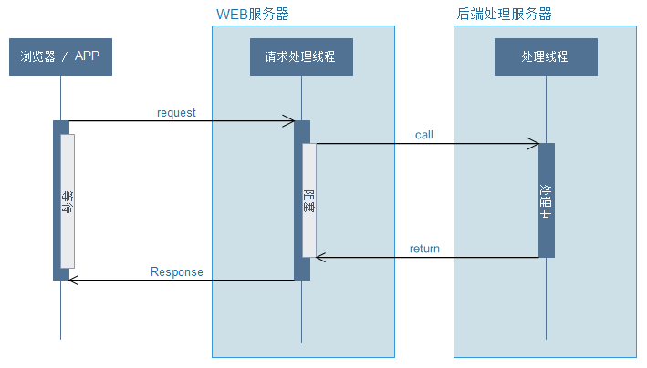
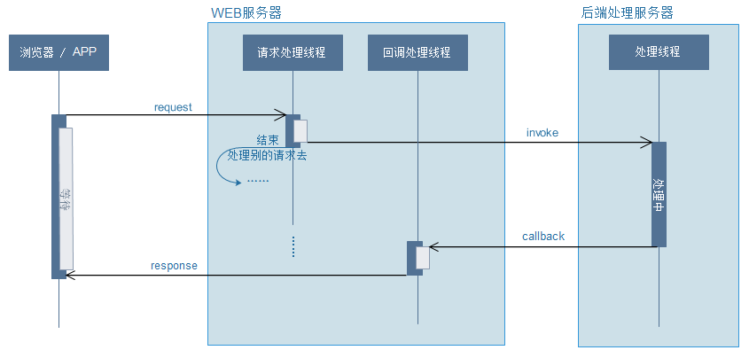

#### springboot异步请求

> 概念：在`Servlet 3.0`之前，`Servlet`采用`Thread-Per-Request`的方式处理请求，即每一次`Http`请求都由某一个线程从头到尾负责处理。如果一个请求需要进行IO操作，比如访问数据库、调用第三方服务接口等，那么其所对应的线程将**同步地等待\****IO操作完成， 而IO操作是**非常慢**的，所以此时的线程并不能及时地释放回线程池以供后续使用，在并发量越来越大的情况下，这将带来严重的性能问题。其请求流程大致为：



> 而在`Servlet3.0`发布后，提供了一个新特性：**异步处理请求**。可以**先释放**容器分配给请求的线程与相关资源，减轻系统负担，释放了容器所分配线程的请求，其**响应将被延后**，可以在耗时处理完成（例如长时间的运算）时再对客户端进行响应。其请求流程为：



> 在`Servlet 3.0`后，我们可以从`HttpServletRequest`对象中获得一个**AsyncContext**对象，该对象构成了异步处理的上下文，`Request`和`Response`对象都可从中获取。`AsyncContext`可以从当前线程传给另外的线程，并在新的线程中完成对请求的处理并返回结果给客户端，初始线程便可以还回给容器线程池以处理更多的请求。如此，通过将请求从一个线程传给另一个线程处理的过程便构成了`Servlet 3.0`中的异步处理。

> 随着`Spring5`发布，提供了一个响应式Web框架：`Spring WebFlux`。之后可能就不需要`Servlet`容器的支持了。以下是其先后对比图：


> 左侧是传统的基于`Servlet`的`Spring Web MVC`框架，右侧是5.0版本新引入的基于`Reactive Streams`的`Spring WebFlux`框架，从上到下依次是**Router Functions**，**WebFlux**，**Reactive Streams**三个新组件。

######1.1: 原生异步请求API说明

在编写实际代码之前，我们来了解下一些关于异步请求的api的调用说明。

- 获取AsyncContext：根据`HttpServletRequest`对象获取。

```java
AsyncContext asyncContext = request.startAsync();
```

- 设置监听器:可设置其开始、完成、异常、超时等事件的回调处理

其监听器的接口代码：

```java
public interface AsyncListener extends EventListener {
    void onComplete(AsyncEvent event) throws IOException;
    void onTimeout(AsyncEvent event) throws IOException;
    void onError(AsyncEvent event) throws IOException;
    void onStartAsync(AsyncEvent event) throws IOException;
}
```

**说明：**

1. onStartAsync：异步线程开始时调用
2. onError：异步线程出错时调用
3. onTimeout：异步线程执行超时调用
4. onComplete：异步执行完毕时调用

一般上，我们在超时或者异常时，会返回给前端相应的提示，比如说超时了，请再次请求等等，根据各业务进行自定义返回。同时，在异步调用完成时，一般需要执行一些清理工作或者其他相关操作。

需要注意的是只有在调用`request.startAsync`前将监听器添加到`AsyncContext`，监听器的`onStartAsync`方法才会起作用，而调用`startAsync`前`AsyncContext`还不存在，所以第一次调用`startAsync`是不会被监听器中的`onStartAsync`方法捕获的，只有在超时后又重新开始的情况下`onStartAsync`方法才会起作用。

- 设置超时：通过`setTimeout`方法设置，单位：毫秒。

**一定要设置超时时间**，不能无限等待下去，不然和正常的请求就一样了。。

######1.2: Servlet方式实现异步请求

前面已经提到，可通过`HttpServletRequest`对象中获得一个**AsyncContext**对象，该对象构成了异步处理的上下文。所以，我们来实际操作下。

0.编写一个简单控制层

```java
/**
 * 使用servlet方式进行异步请求
 * @author oKong
 *
 */
@Slf4j
@RestController
public class ServletController {
    
    @RequestMapping("/servlet/orig")
    public void todo(HttpServletRequest request,
            HttpServletResponse response) throws Exception {
        //这里来个休眠
        Thread.sleep(100);
        response.getWriter().println("这是【正常】的请求返回");
    }
    
    @RequestMapping("/servlet/async")
    public void todoAsync(HttpServletRequest request,
            HttpServletResponse response) {
        AsyncContext asyncContext = request.startAsync();
        asyncContext.addListener(new AsyncListener() {
            
            @Override
            public void onTimeout(AsyncEvent event) throws IOException {
                log.info("超时了：");
                //做一些超时后的相关操作
            }
            
            @Override
            public void onStartAsync(AsyncEvent event) throws IOException {
                // TODO Auto-generated method stub
                log.info("线程开始");
            }
            
            @Override
            public void onError(AsyncEvent event) throws IOException {
                log.info("发生错误：",event.getThrowable());
            }
            
            @Override
            public void onComplete(AsyncEvent event) throws IOException {
                log.info("执行完成");
                //这里可以做一些清理资源的操作
                
            }
        });
        //设置超时时间
        asyncContext.setTimeout(200);
        //也可以不使用start 进行异步调用
//        new Thread(new Runnable() {
//            
//            @Override
//            public void run() {
//                编写业务逻辑
//                
//            }
//        }).start();
        
        asyncContext.start(new Runnable() {            
            @Override
            public void run() {
                try {
                    Thread.sleep(100);
                    log.info("内部线程：" + Thread.currentThread().getName());
                    asyncContext.getResponse().setCharacterEncoding("utf-8");
                    asyncContext.getResponse().setContentType("text/html;charset=UTF-8");
                    asyncContext.getResponse().getWriter().println("这是【异步】的请求返回");
                } catch (Exception e) {
                    log.error("异常：",e);
                }
                //异步请求完成通知
                //此时整个请求才完成
                //其实可以利用此特性 进行多条消息的推送 把连接挂起。。
                asyncContext.complete();
            }
        });
        //此时之类 request的线程连接已经释放了
        log.info("线程：" + Thread.currentThread().getName());
    }

}
```

**注意：异步请求时，可以利用ThreadPoolExecutor自定义个线程池。**

1.启动下应用，查看控制台输出就可以获悉是否在同一个线程里面了。同时，可设置下等待时间，之后就会调用超时回调方法了。大家可自己试试。

```java
2018-08-15 23:03:04.082  INFO 6732 --- [nio-8080-exec-1] c.l.l.s.controller.ServletController     : 线程：http-nio-8080-exec-1
2018-08-15 23:03:04.183  INFO 6732 --- [nio-8080-exec-2] c.l.l.s.controller.ServletController     : 内部线程：http-nio-8080-exec-2
2018-08-15 23:03:04.190  INFO 6732 --- [nio-8080-exec-3] c.l.l.s.controller.ServletController     : 执行完成
```

**使用过滤器时，需要加入asyncSupported为true配置，开启异步请求支持。**

```java
@WebServlet(urlPatterns = "/okong", asyncSupported = true )   
public  class AsyncServlet extends HttpServlet ...
```

**题外话：**其实我们可以利用在未执行`asyncContext.complete()`方法时请求未结束这特性，可以做个简单的文件上传进度条之类的功能。但注意请求是会超时的，需要设置超时的时间下。

######1.3: Spring方式实现异步请求

> 在`Spring`中，有多种方式实现异步请求，比如`callable`、`DeferredResult`或者`WebAsyncTask`。每个的用法略有不同，可根据不同的业务场景选择不同的方式。以下主要介绍一些常用的用法

**Callable方式**

> 使用很简单，直接返回的参数包裹一层`callable`即可。

**用法**

```java
@RequestMapping("/callable")
public Callable<String> callable() {
    log.info("外部线程：" + Thread.currentThread().getName());
    return new Callable<String>() {

        @Override
        public String call() throws Exception {
            log.info("内部线程：" + Thread.currentThread().getName());
            return "callable!";
        }
    };
}
```

控制台输出：

```java
2018-08-15 23:32:22.317  INFO 15740 --- [nio-8080-exec-2] c.l.l.s.controller.SpringController      : 外部线程：http-nio-8080-exec-2
2018-08-15 23:32:22.323  INFO 15740 --- [      MvcAsync1] c.l.l.s.controller.SpringController      : 内部线程：MvcAsync1
```

**超时、自定义线程设置**

从控制台可以看见，异步响应的线程使用的是名为：`MvcAsync1`的线程。第一次再访问时，就是`MvcAsync2`了。若采用默认设置，会无限的创建新线程去处理异步请求，所以正常都需要配置一个线程池及超时时间。

编写一个配置类：`CustomAsyncPool.java`

```java
@Configuration
public class CustomAsyncPool extends WebMvcConfigurerAdapter{

    /**
     * 配置线程池
     * @return
     */
    @Bean(name = "asyncPoolTaskExecutor")
    public ThreadPoolTaskExecutor getAsyncThreadPoolTaskExecutor() {
        ThreadPoolTaskExecutor taskExecutor = new ThreadPoolTaskExecutor();
        taskExecutor.setCorePoolSize(20);
        taskExecutor.setMaxPoolSize(200);
        taskExecutor.setQueueCapacity(25);
        taskExecutor.setKeepAliveSeconds(200);
        taskExecutor.setThreadNamePrefix("callable-");
        //线程池对拒绝任务（无线程可用）的处理策略，目前只支持AbortPolicy、CallerRunsPolicy；默认为后者
        taskExecutor.setRejectedExecutionHandler(new ThreadPoolExecutor.CallerRunsPolicy());
        taskExecutor.initialize();
        return taskExecutor;
    }
    
    @Override
    public void configureAsyncSupport(final AsyncSupportConfigurer configurer) {
        //处理 callable超时
        configurer.setDefaultTimeout(60*1000);
        configurer.registerCallableInterceptors(timeoutInterceptor());
        configurer.setTaskExecutor(getAsyncThreadPoolTaskExecutor());
    }
    
    @Bean
    public TimeoutCallableProcessor timeoutInterceptor() {
        return new TimeoutCallableProcessor();
    }
    
}
```

自定义一个超时异常处理类：`CustomAsyncRequestTimeoutException.java`

```java
/**
 * 自定义超时异常类
 * @author oKong
 *
 */
public class CustomAsyncRequestTimeoutException extends RuntimeException {

    private static final long serialVersionUID = 8754629185999484614L;

    public CustomAsyncRequestTimeoutException(String uri){
        super(uri);
    }
}
```

同时，在**统一异常**处理加入对`CustomAsyncRequestTimeoutException`类的处理即可，这样就有个统一的配置了。

之后，再运行就可以看见使用了自定义的线程池了，超时的可以自行模拟下：

```java
2018-08-15 23:48:29.022  INFO 16060 --- [nio-8080-exec-1] c.l.l.s.controller.SpringController      : 外部线程：http-nio-8080-exec-1
2018-08-15 23:48:29.032  INFO 16060 --- [     oKong-1] c.l.l.s.controller.SpringController      : 内部线程：oKong-1
```

**DeferredResult方式**

> 相比于`callable`，`DeferredResult`可以处理一些相对复杂一些的业务逻辑，最主要还是可以在另一个线程里面进行业务处理及返回，即可在两个完全不相干的线程间的通信。

```java
/**
     * 线程池
     */
    public static ExecutorService FIXED_THREAD_POOL = Executors.newFixedThreadPool(30);
    
@RequestMapping("/deferredresult")
    public DeferredResult<String> deferredResult(){
        log.info("外部线程：" + Thread.currentThread().getName());
        //设置超时时间
        DeferredResult<String> result = new DeferredResult<String>(60*1000L);
        //处理超时事件 采用委托机制
        result.onTimeout(new Runnable() {
            
            @Override
            public void run() {
                log.error("DeferredResult超时");
                result.setResult("超时了!");
            }
        });
        result.onCompletion(new Runnable() {
            
            @Override
            public void run() {
                //完成后
                log.info("调用完成");
            }
        });
        FIXED_THREAD_POOL.execute(new Runnable() {
            
            @Override
            public void run() {
                //处理业务逻辑
                log.info("内部线程：" + Thread.currentThread().getName());
                //返回结果
                result.setResult("DeferredResult!!");
            }
        });
        return result;
    }
```

控制台输出：

```java
2018-08-15 23:52:27.841  INFO 12984 --- [nio-8080-exec-2] c.l.l.s.controller.SpringController      : 外部线程：http-nio-8080-exec-2
2018-08-15 23:52:27.843  INFO 12984 --- [pool-1-thread-1] c.l.l.s.controller.SpringController      : 内部线程：pool-1-thread-1
2018-08-15 23:52:27.872  INFO 12984 --- [nio-8080-exec-2] c.l.l.s.controller.SpringController      : 调用完成
```

**注意：返回结果时记得调用下setResult方法。**

**题外话：利用DeferredResult可实现一些长连接的功能，比如当某个操作是异步时，我们可以保存这个DeferredResult对象，当异步通知回来时，我们在找回这个DeferredResult对象，之后在setResult会结果即可。提高性能。**

**WebAsyncTask方式**

> 使用方法都类似，只是`WebAsyncTask`是直接返回了。觉得就是写法不同而已，更多细节希望大神解答！

```java
@RequestMapping("/webAsyncTask")
   public WebAsyncTask<String> webAsyncTask() {
       log.info("外部线程：" + Thread.currentThread().getName());
       WebAsyncTask<String> result = new WebAsyncTask<String>(60*1000L, new Callable<String>() {

           @Override
           public String call() throws Exception {
               log.info("内部线程：" + Thread.currentThread().getName());
               return "WebAsyncTask!!!";
           }
       });
       result.onTimeout(new Callable<String>() {
           
           @Override
           public String call() throws Exception {
               // TODO Auto-generated method stub
               return "WebAsyncTask超时!!!";
           }
       });
       result.onCompletion(new Runnable() {
           
           @Override
           public void run() {
               //超时后 也会执行此方法
               log.info("WebAsyncTask执行结束");
           }
       });
       return result;
   }
```

控制台输出：

```java
2018-08-15 23:55:02.568  INFO 2864 --- [nio-8080-exec-1] c.l.l.s.controller.SpringController      : 外部线程：http-nio-8080-exec-1
2018-08-15 23:55:02.587  INFO 2864 --- [          oKong-1] c.l.l.s.controller.SpringController      : 内部线程：oKong-1
2018-08-15 23:55:02.615  INFO 2864 --- [nio-8080-exec-2] c.l.l.s.controller.SpringController      : WebAsyncTask执行结束
```

> 本章节主要是讲解了`异步请求`的使用及相关配置，如超时，异常等处理。设置异步请求时，记得不要忘记设置超时时间。**异步请求只是提高了服务的吞吐量，提高单位时间内处理的请求数，并不会加快处理效率的，这点需要注意。**。下一章节，讲讲使用`@Async`进行异步调用相关知识。

推荐博文：[异步开发之异步请求](https://blog.lqdev.cn/2018/08/16/springboot/chapter-twenty/)