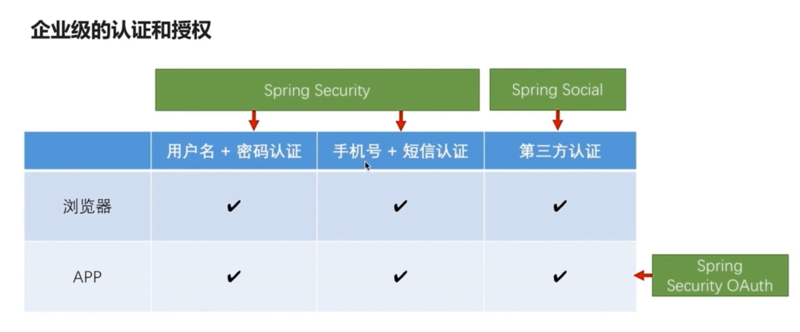
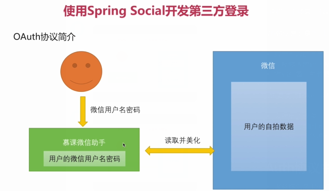
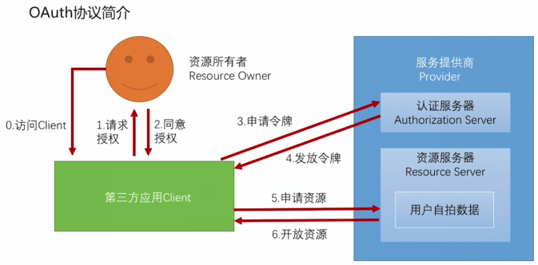
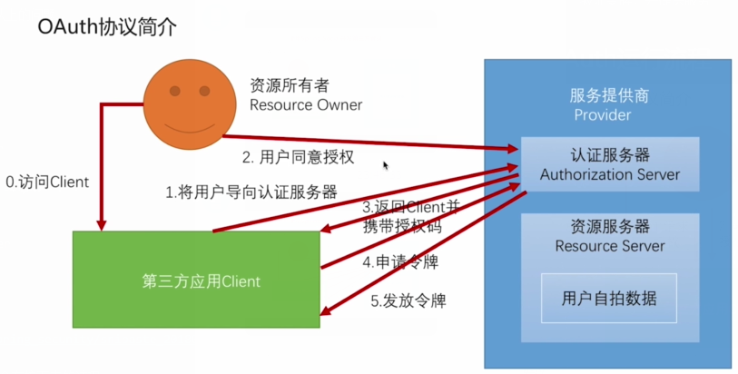
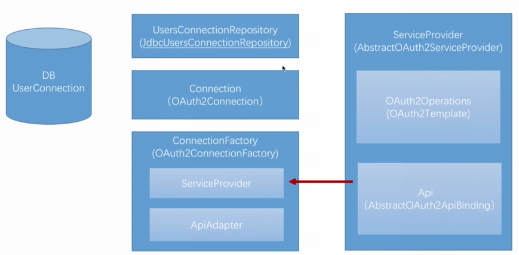

###SpringSecurity、Spring Social、SpringSecurity OAuth的关系 

SpringSecurity是核心；

Spring Social是一个社交项目，作用是连接到社交网站上去，

如在网站登录的时候，我们经常可以看到使用第三方账号登录（微信账号、QQ账号等）

SpringSecurity OAuth，上述的三种方式都是基于浏览器的session的，也就是登录成功后，登录的成功信息是存储在服务器上的session中的。

但是，等客户端是app的时候，是没有session的，我们会使用token的方式来存储用户的认证信息。

SpringSecurity OAuth就是用来创建、管理、分发token用的。

最终效果是能够让我们的应用满足在浏览器中基于session的验证，也可以在app中基于token的验证！

#### OAuth协议简介

- OAuth要解决的问题
- OAuth协议中的各个角色
- OAuth运行流程

####OAuth要解决的问题

考虑这样一个场景：假如开发一个APP-慕课微信图片美化，需要用户存储在微信上的数据；

传统的做法是：拿到用户的用户名密码 
问题：

- 应用可以访问用户在微信上的所有数据；（不能做到读授权一部分功能权限）
- 只能修改密码才能收回授权
- 密码泄露可能性提高

OAuth要使用Token令牌来解决以上的问题

- 令牌绑定权限

- 令牌有过期时间
- 不需要用户的原始密码

####OAuth协议中的各个角色
- 服务提供商 Provider
- 资源所有者 Resource Owner
- 第三方应用 Client
- 认证服务器 Authorization Server派发令牌
- 资源服务器 Resource Server验证令牌，并提供服务

####OAuth运行流程

同意授权是关键；只有同意了才会有接下来的流程

OAuth提供了4中授权方式

授权码模式 Authorization code
简化模式 implicit
密码模式 resource owner Password credentials
客户端模式 client credentials
####授权码模式流程

该模式与其他三种模式不同，最重要的区别就是：同意授权这个动作，是在认证服务器上完成的，而其他的三种都是在第三方应用上完成的。

该模式是4中模式中最严格最完整的一种协议,同时也是应用最广泛的模式

####简化模式

在授权后直接带回令牌

#### spring security 与 oauth social的关系

还是上次那个图片示例，如果只是获取微信的昵称头像信息，

在spring security中被认定为认证成功的标志是：根据用户信息构建Authentication放入SecurityContext中

所以只要引导用户走完oath的所有流程。最后根据用户信息构建Authentication放入SecurityContext中

social的原理： 
基于我们之前学习过的过滤链原理，在过滤器链上增加了一个 SocialAuthenticationFilter，

拦截到有需要第三方登录的请求则开始引导完成所有的流程，就完成了第三方登录

social基本概念和原理
之前1-5步都是协议化流程步骤

这里只是介绍的是与我们要写代码相关的流程；实现这些节点就可以运行了。

- OAuth2Operations（OAuth2Template） ： 封装了1-5的步骤
- Api（AbstractOAuth2ApiBinding） 对第6步提供了支持
- Connection （OAuth2Connection） 包含用户信息的对象
- ConnectionFactory（OAuth2ConnectionFactory） 
  - ServiceProvider 创建Connection，要走1-5的流程，所以包含ServiceProviderApiAdapter 
  - OAuth2Connection是固定结构的数据，对第三方api返回的数据进行匹配；读取用户信息

在 social 中是存在数据库中的，存放的是业务系统的userid月服务商用户的一个对应关系；

由谁来操作这个数据库中的表呢？

UsersConnectionRepository（JdbcUsersConnectionRepository)

官网 ：` https://projects.spring.io/spring-social/`

官网中页面信息提供了

Main Projects 官网已发布的项目，如连接Facebook的项目（上面讲的基本上都实现了，可能只需要简单的配置即可）
Incubator Projects 孵化中的项目，也就是正在开发中的
Community Projects 社区项目，非官网提供，但是放在这里应该质量还算是比较好的吧
该课程会接收QQ和微信登录

qq的oath协议实现比较标准；使用scocial实现qq登录

微信的oath协议不是很标准，有特性化的在里面；重点关注怎么处理特性化的