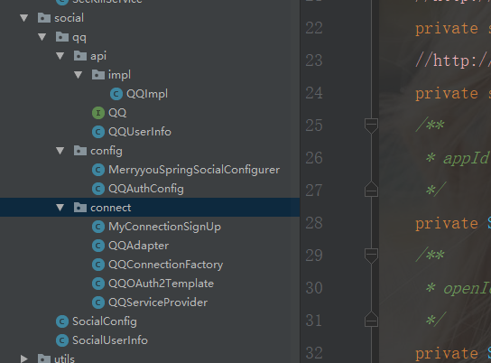

##SpringSecurity开发QQ登录

1. 请求第三方应用
2. 第三方应用将用户请求导向服务提供商
3. 用户同意授权
4. 服务提供商返回code
5. client根据code去服务提供商换取令牌
6. 返回令牌
7. 获取用户信息

根据上面接收的原理，开发思路是：

最终我们是要获取到Connection,

那么就需要使用ConnectionFactory创建

而ConnectionFactory又需要ServiceProvider和ApiAdapter；

倒退流程，走到最后就是先实现Api。

http://wiki.connect.qq.com/api%E5%88%97%E8%A1%A8

我们先来看一下整体项目结构



1. ‘api’ 定义api绑定的公共接口
2. ‘config’ qq的一些配置信息
3. ‘connect’与服务提供商建立连接所需的一些类。

#### 定义返回用户信息接口

```java
public interface QQ {
    /**
     * 获取用户信息
     * @return
     */
    QQUserInfo getUserInfo();
}
```

#### 实现返回用户信息接口

```java
@Slf4j
public class QQImpl extends AbstractOAuth2ApiBinding implements QQ {

    //http://wiki.connect.qq.com/openapi%E8%B0%83%E7%94%A8%E8%AF%B4%E6%98%8E_oauth2-0
    private static final String QQ_URL_GET_OPENID = "https://graph.qq.com/oauth2.0/me?access_token=%s";
    //http://wiki.connect.qq.com/get_user_info(access_token由父类提供)
    private static final String QQ_URL_GET_USER_INFO = "https://graph.qq.com/user/get_user_info?oauth_consumer_key=%s&openid=%s";
    /**
     * appId 配置文件读取
     */
    private String appId;
    /**
     * openId 请求QQ_URL_GET_OPENID返回
     */
    private String openId;
    /**
     * 工具类
     */
    private ObjectMapper objectMapper = new ObjectMapper();

    /**
     * 构造方法获取openId
     */
    public QQImpl(String accessToken, String appId) {
        //access_token作为查询参数来携带。
        super(accessToken, TokenStrategy.ACCESS_TOKEN_PARAMETER);

        this.appId = appId;

        String url = String.format(QQ_URL_GET_OPENID, accessToken);
        String result = getRestTemplate().getForObject(url, String.class);

        log.info("【QQImpl】 QQ_URL_GET_OPENID={} result={}", QQ_URL_GET_OPENID, result);

        this.openId = StringUtils.substringBetween(result, "\"openid\":\"", "\"}");
    }

    @Override
    public QQUserInfo getUserInfo() {
        String url = String.format(QQ_URL_GET_USER_INFO, appId, openId);
        String result = getRestTemplate().getForObject(url, String.class);

        log.info("【QQImpl】 QQ_URL_GET_USER_INFO={} result={}", QQ_URL_GET_USER_INFO, result);

        QQUserInfo userInfo = null;
        try {
            userInfo = objectMapper.readValue(result, QQUserInfo.class);
            userInfo.setOpenId(openId);
            return userInfo;
        } catch (Exception e) {
            throw new RuntimeException("获取用户信息失败", e);
        }
    }
}
```

`QQUserInfo`类即是获取到的qq用户信息，具体类不贴了，可参考链接<http://wiki.connect.qq.com/get_user_info>

#### QQOAuth2Template处理qq返回的令牌信息

```java
@Slf4j
public class QQOAuth2Template extends OAuth2Template {
    public QQOAuth2Template(String clientId, String clientSecret, String authorizeUrl, String accessTokenUrl) {
        super(clientId, clientSecret, authorizeUrl, accessTokenUrl);
        setUseParametersForClientAuthentication(true);
    }

    @Override
    protected AccessGrant postForAccessGrant(String accessTokenUrl, MultiValueMap<String, String> parameters) {
        String responseStr = getRestTemplate().postForObject(accessTokenUrl, parameters, String.class);

        log.info("【QQOAuth2Template】获取accessToke的响应：responseStr={}" + responseStr);

        String[] items = StringUtils.splitByWholeSeparatorPreserveAllTokens(responseStr, "&");
        //http://wiki.connect.qq.com/使用authorization_code获取access_token
    //access_token=FE04************************CCE2&expires_in=7776000&refresh_token=88E4************************BE14
        String accessToken = StringUtils.substringAfterLast(items[0], "=");
        Long expiresIn = new Long(StringUtils.substringAfterLast(items[1], "="));
        String refreshToken = StringUtils.substringAfterLast(items[2], "=");

        return new AccessGrant(accessToken, null, refreshToken, expiresIn);
    }


    /**
     * 坑，日志debug模式才打印出来 处理qq返回的text/html 类型数据
     *
     * @return
     */
    @Override
    protected RestTemplate createRestTemplate() {
        RestTemplate restTemplate = super.createRestTemplate();
        restTemplate.getMessageConverters().add(new StringHttpMessageConverter(Charset.forName("UTF-8")));
        return restTemplate;
    }
}
```

#### QQServiceProvider连接服务提供商

```java
public class QQServiceProvider extends AbstractOAuth2ServiceProvider<QQ> {

    /**
     * 获取code
     */
    private static final String QQ_URL_AUTHORIZE = "https://graph.qq.com/oauth2.0/authorize";
    /**
     * 获取access_token 也就是令牌
     */
    private static final String QQ_URL_ACCESS_TOKEN = "https://graph.qq.com/oauth2.0/token";
    private String appId;

    public QQServiceProvider(String appId, String appSecret) {
        super(new QQOAuth2Template(appId, appSecret, QQ_URL_AUTHORIZE, QQ_URL_ACCESS_TOKEN));
        this.appId = appId;
    }

    @Override
    public QQ getApi(String accessToken) {

        return new QQImpl(accessToken, appId);
    }
}
```


#### QQConnectionFactory连接服务提供商的工厂类

```java
public class QQConnectionFactory extends OAuth2ConnectionFactory<QQ> {

    public QQConnectionFactory(String providerId, String appId, String appSecret) {
        super(providerId, new QQServiceProvider(appId, appSecret), new QQAdapter());
    }
}
```

#### QQAdapter 适配spring Social默认的返回信息

```java
public class QQAdapter implements ApiAdapter<QQ> {
    @Override
    public boolean test(QQ api) {
        return true;
    }

    @Override
    public void setConnectionValues(QQ api, ConnectionValues values) {
        QQUserInfo userInfo = api.getUserInfo();

        values.setProviderUserId(userInfo.getOpenId());//openId 唯一标识
        values.setDisplayName(userInfo.getNickname());
        values.setImageUrl(userInfo.getFigureurl_qq_1());
        values.setProfileUrl(null);// 主页地址，像微博一般有主页地址
    }

    @Override
    public UserProfile fetchUserProfile(QQ api) {
        return null;
    }

    @Override
    public void updateStatus(QQ api, String message) {

    }
}
```

#### SocialConfig 社交配置主类

```java
@Configuration
@EnableSocial
public class SocialConfig extends SocialConfigurerAdapter {

    /**
     * 社交登录配类
     *
     * @return
     */
    @Bean
    public SpringSocialConfigurer merryyouSocialSecurityConfig() {
        String filterProcessesUrl = SecurityConstants.DEFAULT_SOCIAL_QQ_PROCESS_URL;
        MerryyouSpringSocialConfigurer configurer = new MerryyouSpringSocialConfigurer(filterProcessesUrl);
        return configurer;
    }

    /**
     * 处理注册流程的工具类
     * @param factoryLocator
     * @return
     */
    @Bean
    public ProviderSignInUtils providerSignInUtils(ConnectionFactoryLocator factoryLocator) 			{
        return new ProviderSignInUtils(factoryLocator,getUsersConnectionRepository(factoryLocator));
    }

}
```

####QQAuthConfig 针对qq返回结果的一些操作

```java
@Configuration
public class QQAuthConfig extends SocialAutoConfigurerAdapter {

    @Autowired
    private DataSource dataSource;

    @Autowired
    private ConnectionSignUp myConnectionSignUp;

    @Override
    protected ConnectionFactory<?> createConnectionFactory() {
        return new QQConnectionFactory(
               					SecurityConstants.DEFAULT_SOCIAL_QQ_PROVIDER_ID, 					      							SecurityConstants.DEFAULT_SOCIAL_QQ_APP_ID, 
          SecurityConstants.DEFAULT_SOCIAL_QQ_APP_SECRET);
    }

    @Override
    public UsersConnectionRepository getUsersConnectionRepository(ConnectionFactoryLocator connectionFactoryLocator) {
        JdbcUsersConnectionRepository repository = new JdbcUsersConnectionRepository(dataSource,
                connectionFactoryLocator, Encryptors.noOpText());
        // 如果需要指定表前缀，因为后缀是固定的，在JdbcUsersConnectionRepository所在位置
        repository.setTablePrefix("imooc_");
        if (myConnectionSignUp != null) {
            repository.setConnectionSignUp(myConnectionSignUp);
        }
        return repository;
    }
}
```

#### MerryyouSpringSocialConfigurer自定义登录和注册连接

```java
public class MerryyouSpringSocialConfigurer extends SpringSocialConfigurer {

    private String filterProcessesUrl;

    public MerryyouSpringSocialConfigurer(String filterProcessesUrl) {
        this.filterProcessesUrl = filterProcessesUrl;
    }

    @Override
    protected <T> T postProcess(T object) {
        SocialAuthenticationFilter filter = (SocialAuthenticationFilter) super.postProcess(object);
        filter.setFilterProcessesUrl(filterProcessesUrl);
        filter.setSignupUrl("/register");
        return (T) filter;
    }
}
```

#### 开启SocialAuthenticationFilter过滤器

```java
@Autowired
    private SpringSocialConfigurer merryyouSpringSocialConfigurer;

    @Override
    protected void configure(HttpSecurity http) throws Exception {
        http.addFilterBefore(validateCodeFilter, UsernamePasswordAuthenticationFilter.class)
                .formLogin()//使用表单登录，不再使用默认httpBasic方式
                .loginPage(SecurityConstants.DEFAULT_UNAUTHENTICATION_URL)//如果请求的URL需要认证则跳转的URL
                .loginProcessingUrl(SecurityConstants.DEFAULT_SIGN_IN_PROCESSING_URL_FORM)//处理表单中自定义的登录URL
                .and()
                .apply(merryyouSpringSocialConfigurer)
                .and()
                .authorizeRequests().antMatchers(SecurityConstants.DEFAULT_UNAUTHENTICATION_URL,
                SecurityConstants.DEFAULT_SIGN_IN_PROCESSING_URL_FORM,
                SecurityConstants.DEFAULT_REGISTER_URL,
                "/register",
                "/social/info",
                "/**/*.js",
                "/**/*.css",
                "/**/*.jpg",
                "/**/*.png",
                "/**/*.woff2",
                "/code/image")
                .permitAll()//以上的请求都不需要认证
                //.antMatchers("/").access("hasRole('USER')")
                .and()
                .csrf().disable()//关闭csrd拦截
        ;
        //安全模块单独配置
        authorizeConfigProvider.config(http.authorizeRequests());
    }
```

推荐博文

- [Spring Security技术栈开发企业级认证与授权-笔记](<https://blog.csdn.net/mr_zhuqiang/article/details/81502354>)
- [Spring Security源码分析](<https://niocoder.com/categories/#Security>)

