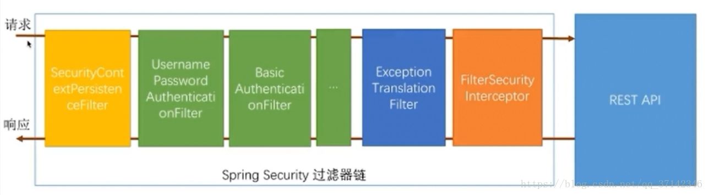
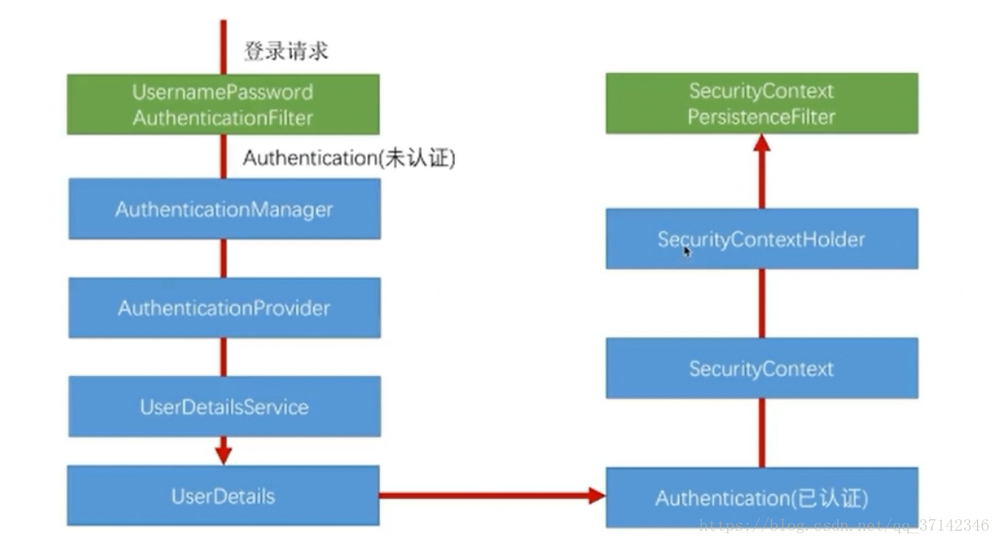

### 使用SpringSecurity开发基于表单的认证

####一、SpringSecurity核心功能

- 认证

识别当前用户是否合法

即：你是谁

- 授权

当前用户能访问的数据、页面权限

即：你能干什么

- 攻击防护

防止伪造身份

####二、SpringSecurity基本原理

#####案例演示

######默认HttpBasic验证行为 

- 开启SpringSecurity配置(引入start默认开启)

- 访问接口

我们在浏览器中输入 `http://localhost:8080/hello`

发现并没有访问到接口，而是弹出一个认证窗口


这个其实就是SpringSecurity默认行为搞的鬼

默认的用户名：user，密码在启动日志中能看到


`hello spring security`

> 在引入了基于SpringBoot的SpringSecurity后，其默认行为会拦截保护所有对服务器的访问。
> 每个请求都需要`用户名/密码`认证
> 这种由`SpringSecurity`提供的默认校验方式叫做`httpBasic`，
> 实际环境中基本没用，所以我们往往需要自定义

###### 覆盖掉HttpBasic行为：跳转表单认证

通过继承`WebSecurityConfigurerAdapter`适配器类，实现我们自定义的`SpringSecurity`配置逻辑

- 需求

由`HttpBasic`的弹窗认证，改为表单认证

```java
@SpringBootApplication(scanBasePackageClasses = {DemoApplication.class, BrowserSecurityConfig.class})
@RestController
public class DemoApplication {
    public static void main(String[] args) {
        SpringApplication.run(DemoApplication.class);
    }

    @GetMapping("/hello")
    public String hello() {
        return "Hello Spring Security";
    }
}
```

我们进行自定义配置

```java
package com.imooc.security.browser;

import org.springframework.context.annotation.Configuration;
import org.springframework.security.config.annotation.web.builders.HttpSecurity;
@Configuration
public class BrowserSecurityConfig extends WebSecurityConfigurerAdapter {

    @Override
    protected void configure(HttpSecurity http) throws Exception {
			// http.httpBasic() 默认的弹窗配置	
      // 设置表单认证方式
        http.formLogin()
                .and()
								// 对请求进行授权
                .authorizeRequests()
								// 认证请求
                .anyRequest()
								// 都需要身份认证
                .authenticated();
    }
}

```

此时，我们访问`/hello`，认证界面为：


我们访问/hello，SpringSecurity发现这个接口需要认证，然后就自动跳转到了/login，然后就跳转到了默认的表单登陆页面我们输入默认的user用户名和密码，就能够访问到/hello接口了

#####原理说明

- 过滤器链机制

我们使用颜色对过滤器进行分类



**绿色**

---

绿色的过滤器，代表一种认证方式，如UsernamePasswordAuthenticationFilter，处理表单登陆

BasicAuthenticationFilter，处理httpBasic

绿色的过滤器，检查当前的请求中，是否有当前过滤器所需的信息

UsernamePasswordAuthenticationFilter：首先判断当前是不是登陆请求，然后判断这个请求中有没有带用户名/密码，如果带了，则进行校验，如果没带，则放行，走下一个过滤器

BasicAuthenticationFilter：判断请求头中有没有Basic开头的认证信息，有则认证，没有，则放行，走下一个过滤器

**任何一个绿色的过滤器，认证成功后，会对当前请求做一个标记，表示认证成功了**

> 注意，所有的绿色过滤器都会生效。然后根据我们的请求参数符合哪个过滤器，哪个过滤器就会处理本次认证,责任链模式

**蓝色**

---

`蓝色`用于捕获`橙色`抛出来的异常，当`认证不通过`的时候，橙色是会抛出异常的

蓝色过滤器捕获到橙色过滤器的异常后，将异常传递给对应的绿色过滤器，进行认证不通过时的处理

如对于表单认证，就会跳转到表单登陆页面

**橙色**

---

`橙色`的过滤器，过滤器链的最后一层，由其决定是否对当前请求放行。一旦放行，就能够访问到REST API

判断依据为代码中的配置

```java
http.formLogin()
                .and()
								// 对请求进行授权
                .authorizeRequests()
								// 认证请求
                .anyRequest()
								// 都需要身份认证
                .authenticated();
```

就会要求所有的接口，必须被认证后才能访问

这个配置逻辑现在是比较简单的，事实上可以配置得非常复杂，如放行某些接口，某些接口只有某些客户才能访问等等

- 过滤器类型
  只有图中`绿色`的过滤器是可以由我们控制是否生效，并且支持自定义的。另外两种类型的过滤器不是由我们控制的

#####源代码导读

我们阅读下面几个类

`UsernamePasswordAuthenticationFilter`
负责表单登陆的过滤器

`ExceptionTranslationFilter`
处理认证过程中的异常

`FilterSecurityInterceptor`
判断认证是否通过

当我们直接访问API的时候，FilterSecurityInterceptor检测到认证未通过，异常被ExceptionTranslationFilter`捕获到，根据我们的配置，跳转到默认的登陆页面上。

在登陆页面中输入了正确的用户名密码，被UsernamePasswordAuthenticationFilter认证通过，最终FilterSecurityInterceptor确认可以访问，遂成功访问到API

#### 三、用户名+密码认证

##### 自定义用户认证逻辑
- 怎么获取用户认证的信息？

- 怎么校验用户认证信息？

- 加密解密

###### 获取用户信息：UserDetailsService
如何获取用户信息，在SpringSecurity中，是被封装在UserDetailsService接口中的，我们实现这个接口，将查询到的用户信息保存到UserDetails对象中，SpringSecurity会根据UserDetails中的密码，与用户请求中填写的密码进行比较

- **小结**

  UserDetailsService：接口用于获取用户身份信息
  UserDetails：接口用于保存获取到的用户信息

org.springframework.security.core.userdetails.User：是Spring Security为我们提供的对UserDetails的一个实现。

- 下面我们自己实现一下`UserDetailsService`接口

```java

public interface UserRepository extends JpaRepository<User, Integer> {
 
	@Query(value = "select * from user where username=?1 or mobile=?1",nativeQuery = true)
	User loadUserInfo(String username);
 
}
```

```java
package com.imooc.security.browser;

import lombok.extern.slf4j.Slf4j;
import org.springframework.security.core.authority.AuthorityUtils;
import org.springframework.security.core.userdetails.User;
import org.springframework.security.core.userdetails.UserDetails;
import org.springframework.security.core.userdetails.UserDetailsService;
import org.springframework.security.core.userdetails.UsernameNotFoundException;
import org.springframework.stereotype.Component;

@Component
@Slf4j
public class MyUserDetailsService implements UserDetailsService {

  @Autowired
	private UserRepository userRepository;
  
    @Override
    public UserDetails loadUserByUsername(String username) throws UsernameNotFoundException {
      
         log.info("获取用户名：{} 的认证信息", username);

        //从数据库中获取用户信息
      	User user = userRepository.loadUserInfo(username);
				log.info("用户信息" + user);
        return new User(username, user.getPassWord(), AuthorityUtils.commaSeparatedStringToAuthorityList("admin"));
    }
}
```

注意：@Component这个注解需要定义，否则在上面代码中不会使用我们自定义的获取UserDetail的方式，而是使用默认的获取方式，根据springboot约定优于配置原则，自定义便不再使用默认配置。username为前端传递过来的用户名，我们从数据库中查询出这个用户的权限信息，AuthorityUtils.commaSeparatedStringToAuthorityList("admin")将角色字符串转化成所需的类型使用User对象封装后进行返回，Spring Security会将返回的真实认证信息与用户输入的认证信息进行比较，如果不相符则会提示`坏的凭证`

###### 校验用户：UserDetails

UserDetails接口提供了4个方法，可以由我们自定义实现

|          方法           |                 说明                  |
| :---------------------: | :-----------------------------------: |
|   isAccountNonExpired   |      用户是否未过期，true-未过期      |
|   isAccountNonLocked    |   用户是否未锁定，冻结，true-未冻结   |
| isCredentialsNonExpired |      密码是否未过期，true-未过期      |
|        isEnabled        | 用户是否未可用，被删除，true-未被删除 |

###### 密码处理：PasswordEncoder
我们不会把密码的明文存到数据库中


```java
package org.springframework.security.crypto.password;
public interface PasswordEncoder {
String encode(CharSequence rawPassword);

boolean matches(CharSequence rawPassword, String encodedPassword);
}
```


|  方法   |                             说明                             |
| :-----: | :----------------------------------------------------------: |
| encode  |                加密，用户注册入库的时候会调用                |
| matches | 判断密码是否正确
一般在新增用户的时候，调用encode，将用户的密码加密后入库 |

matches一般由Spring Security进行调用 把我们返回的 UserDetails对象中的密码与本次用户输入的进行比较

在上述中，我们使用123456作为密码返回，这个不是密文，用户登陆的时候输入的也是123456，竟然可以通过。 这是因为我们当前还没配置过PasswordEncoder，我们配置一个Spring Security为我们提供的PasswordEncoder

```java
@Bean
public PasswordEncoder passwordEncoder(){
    return new BCryptPasswordEncoder();
}
```

此时，我们在UserDetails对象中的密码就必须是用BCryptPasswordEncoder加密过的密文才行了,SpringSecurity将用户输入的密码，与返回的加密密码，通过调用matches方法进行校验。

##### 自定义用户认证流程

- 自定义登陆页面
- 自定义登陆成功处理

默认是跳转请求的url

- 自定义登陆失败处理

默认是显示错误信息

###### 自定义登陆页 

- 编写html

在`browser`项目中编写自定义登陆页面imooc-signIn.html,放在resource/static文件夹下面

```html
<!DOCTYPE html>
<html>
<head>
    <meta charset="UTF-8">
    <title>登录</title>
</head>
<body>
<h2>标准登录页面</h2>
<h3>表单登录</h3>
<form action="/authentication/form" method="post">
    <table>
        <tr>
            <td>用户名:</td>
            <td><input type="text" name="username"></td>
        </tr>
        <tr>
            <td>密码:</td>
            <td><input type="password" name="password"></td>
        </tr>
        <tr>
            <td colspan="2">
                <button type="submit">登录</button>
            </td>
        </tr>
    </table>
</form>

</body>
</html>
```

- 修改`BrowserSecurityConfig`配置文件

```java
@Configuration
public class BrowserSecurityConfig extends WebSecurityConfigurerAdapter {

    @Bean
    public PasswordEncoder passwordEncoder() {
        return new BCryptPasswordEncoder();
    }

    @Override
    protected void configure(HttpSecurity http) throws Exception {

				//  设置认证方式
        http.formLogin()
								//   检测到未登录，跳转到登陆页面
                .loginPage("/imooc-signIn.html")
								//  配置处理登陆请求的url,即登陆页面提交的请求地址
                .loginProcessingUrl("/authentication/form")
                .and()
								//  配置认证请求方式
                .authorizeRequests()
								//  跳转到登陆页面的请求不需要认证
                .antMatchers("/imooc-signIn.html").permitAll()
								//  所有的请求
                .anyRequest()
								//  都需要身份认证
                .authenticated()
								//  忽略CSRF认证，是Spring Boot Security默认配置的一个安全项（跨站请求防护），暂时关闭
                .and()
                .csrf().disable();

    }
}
```

此时我们再访问接口，发现就是跳转到我们的自定义认证页面了

坑
这里有一个注意点，一开始的时候，页面跳转的时候报了个404错。原因在于html页面并没有被打包。

修改根pom的resources配置，添加<include>**/*.html</include>即可

默认SpringSecurity处理的表单登陆请求为/login，在这个自定义页面中，我使用了自定义的/authentication/form，所以需要在BrowserSecurityConfig中进行配置.loginProcessingUrl("/authentication/form")

##### 处理不同类型的请求html or json


目前，当我们访问API，检测到需要认证，自动跳转到了一个html登陆页面，那么如果是一个app来访问我们呢？这么做就不是那么合理了。所以，我们下面做一个功能，通过用户的请求不同，决定跳转到html登陆页，还是访问json信息。

######自定义Controller

编写一个自定义Controller，判断是请求认证失败后，按照html处理还是按照json处理

```java
@RestController
@Slf4j
public class BrowserSecurityController {
    //请求的缓存对象
    private RequestCache requestCache = new HttpSessionRequestCache();
    //跳转工具类
    private RedirectStrategy redirectStrategy = new DefaultRedirectStrategy();

    /**
     * 当需要身份认证时，跳转到此请求
     *
     * @param request
     * @param response
     * @return
     */
    @RequestMapping("/authentication/require")
    @ResponseStatus(code = HttpStatus.UNAUTHORIZED)//返回401状态码，表示未授权
    public SimpleResponse requireAuthentication(HttpServletRequest request, HttpServletResponse response) throws IOException {
        SavedRequest savedRequest = requestCache.getRequest(request, response);
        if (savedRequest != null) {
            String target = savedRequest.getRedirectUrl();//引发跳转的url
            log.info("引发跳转的URL：{}", target);
            if (StringUtils.endsWithIgnoreCase(target, ".html")) {//如果引发跳转的url后缀为html，则跳转到html登陆页面
                //跳转到自定义配置的登陆页面
                redirectStrategy.sendRedirect(request, response, "/imooc-signIn.html");
            }
        }
        return new SimpleResponse("访问的服务需要身份认证");
    }
}
```

###### 修改配置类

```java
@Configuration
public class BrowserSecurityConfig extends WebSecurityConfigurerAdapter {

    @Bean
    public PasswordEncoder passwordEncoder() {
        return new BCryptPasswordEncoder();
    }

    @Override
    protected void configure(HttpSecurity http) throws Exception {

				//  设置认证方式
        http.formLogin()
								//   检测到未登录，跳转到登陆页面  或  处理跳转的Controller地址
                .loginPage("/authentication/require")
								//  配置处理登陆请求的url,即登陆页面提交的请求地址
                .loginProcessingUrl("/authentication/form")
                .and()
								//  配置认证请求方式
                .authorizeRequests()
								//  跳转到登陆页面的请求不需要认证
                .antMatchers("/imooc-signIn.html", "/authentication/require").permitAll()
								//  所有的请求
                .anyRequest()
								//  都需要身份认证
                .authenticated()
								//  忽略CSRF认证，是Spring Boot Security默认配置的一个安全项（跨站请求防护），暂时关闭
                .and()
                .csrf().disable();

    }
}
```

##### 认证成功、失败自定义处理

默认情况下，登陆成功后，去访问原先请求的URL。但在实际场景中，我们在登陆成功后，往往需要做很多操作，如登陆日志的记录等等。

默认情况下，登陆失败后，是在登陆页面显示错误信息。如果我们还想有些额外的操作，该如何处理呢？

###### AuthenticationSuccessHandler
自定义认证成功处理类

```java
@Component("imoocAuthSuccessHandler")
@Slf4j
public class ImoocAuthSuccessHandler implements AuthenticationSuccessHandler {

    @Autowired
    private ObjectMapper objectMapper;

    @Override
    public void onAuthenticationSuccess(HttpServletRequest request, HttpServletResponse response, Authentication authentication) throws ServletException, IOException {

        log.info("登陆成功");
        response.setContentType(MediaType.APPLICATION_JSON_UTF8_VALUE);
        response.getWriter().write(objectMapper.writeValueAsString(authentication));
    }
}
```

我们不再实现接口，而是继承`SavedRequestAwareAuthenticationSuccessHandler`，这个是`SpringSecurity`默认的成功处理器

```java
@Component("imoocAuthSuccessHandler")
@Slf4j
public class ImoocAuthSuccessHandler extends SavedRequestAwareAuthenticationSuccessHandler {

    private RedirectStrategy redirectStrategy = new DefaultRedirectStrategy();

    @Autowired
    private ObjectMapper objectMapper;

    @Autowired
    private SecurityProperties securityProperties;

    @Override
    public void onAuthenticationSuccess(HttpServletRequest request, HttpServletResponse response, Authentication authentication) throws ServletException, IOException {

        log.info("登陆成功：{}", securityProperties.getBrowser().getLoginType());
				//如果当前系统配置的是json请求
        if (LoginType.JSON == securityProperties.getBrowser().getLoginType()) {
            response.setContentType(MediaType.APPLICATION_JSON_UTF8_VALUE);
//            response.getWriter().write(objectMapper.writeValueAsString(authentication));
            log.info(ReflectionToStringBuilder.toString(authentication, ToStringStyle.MULTI_LINE_STYLE));
            //然后按照默认处理，继续调用请求的接口
            super.onAuthenticationSuccess(request, response, authentication);
        } else {
          //如果当前系统配置的不是json，则按照默认处理，默认处理请求的接口
        //redirectStrategy.sendRedirect(request,response,"/index1.html");//跳转到自定义的页面上
            super.onAuthenticationSuccess(request, response, authentication);
        }
    }
}

```

###### AuthenticationFailureHandler

自定义认证失败处理类

```java
@Slf4j
@Component("/imoocAuthFailureHandler")
public class ImoocAuthFailureHandler extends SimpleUrlAuthenticationFailureHandler {
    @Autowired
    private ObjectMapper objectMapper;

    @Autowired
    private SecurityProperties securityProperties;

    @Override
    public void onAuthenticationFailure(HttpServletRequest request, HttpServletResponse response, AuthenticationException e) throws IOException, ServletException {
        log.info("登陆失败:{}", securityProperties.getBrowser().getLoginType());

        if (LoginType.JSON == securityProperties.getBrowser().getLoginType()) {
            response.setContentType(MediaType.APPLICATION_JSON_UTF8_VALUE);
            response.setStatus(HttpStatus.INTERNAL_SERVER_ERROR.value());
            response.getWriter().write(objectMapper.writeValueAsString(new SimpleResponse(e.getMessage())));
        } else {
            //默认跳转到登陆认证页
            super.onAuthenticationFailure(request, response, e);
        }
    }
}
```

###### 配置

我们的成功、失败处理器，只有配置后才会起作用


##### 获取认证用户的信息

系统中往往会有这种需求，就是需要知道当前访问的人是谁

从线程中获取

```java
@GetMapping("/me")
public Object getCurrentUser(){
    return SecurityContextHolder.getContext().getAuthentication();
}
```


SpringMVC自动注入

```java
@GetMapping("/me1")
public Object getCurrentUser(Authentication authentication){
    return authentication;
}
```

##### 深入理解认证流程



`SecurityContextPersistenceFilter`

进来的时候检查`session`中是否有认证信息，有，放到请求线程中；

出去的时候检查线程中是否有认证信息，有，放到`session`中

#### 四、记住我

##### 原理

这个也是身份认证的一个常见特性

即：用户登录认证成功后，在一段时间内不需要重复认证


1、首次登陆后，cookie和用户信息会存到数据库
2、下一次登陆的时候，经过 RememberMeAuthenticationFilter ,拿着cookie去数据库查询用户
3、用2中返回的用户自动执行认认证逻辑

RememberMeAuthenticationFilter是最后一个绿色的过滤器，当所有过滤器都没法认证的时候，就使用RememberMeAuthenticationFilter进行认证。

#### 五、手机号+短信认证

除了用户名密码登录外，手机号+短信验证码登录也是一种常见的登陆方式

用户名密码登陆过程中，由`SpringSecurity`提供的过滤器实现认证，手机号+短信的认证方式中，我们只验证手机，验证码在更前面的验证码过滤器中进行校验。

- 开发短信发送接口
- 校验短信验证码并登陆
- 代码重构

##### 整合验证码代码重构

我们已经开发了一个图形验证码接口，我们就在此基础上进行开发

其实逻辑和开发图形验证码是类似的

1、生成

2、存入session

3、告知使用者

像这种主干逻辑相同，但是步骤实现不同，我们可以使用模板方法的模式抽象出来


从`ValidateCodeController`作为入口来看

具体逻辑以代码为主

主要是代码重构的技巧，不是`SpringSecurity`的内容，这里就不赘述了

##### 短信校验配置流程


不同的认证方式需要由不同的过滤器来处理，对于用户名密码形式的表单认证，系统已经提供了对应的过滤器。

下面，我们就需要根据仿照这个流程，对短信验证码的登陆形式进行一次认证。实现一些自定义的类

> 注意，本流程只是对手机号进行校验，不是对手机号和短信验证码进行校验。。 短信验证码的校验放在更前面的过滤器中。走一遍这个流程，是为了让用户处于已认证状态。之所以短信验证码单独提取出来，是因为短信验证码、图形验证码，这个都是比较通用的功能，在系统的好多地方都能够用到。

##### SmsCodeAuthenticationToken`

`SmsCodeAuthenticationToken`是用户身份对象

```java
package com.imooc.security.core.auth.mobile;

import org.springframework.security.authentication.AbstractAuthenticationToken;
import org.springframework.security.core.GrantedAuthority;
import java.util.Collection;

public class SmsCodeAuthenticationToken extends AbstractAuthenticationToken {
    private static final long serialVersionUID = 420L;
    private final Object principal;

    public SmsCodeAuthenticationToken(String mobile) {
        super((Collection)null);
        this.principal = mobile;
        this.setAuthenticated(false);
    }

    public SmsCodeAuthenticationToken(Object principal, Collection<? extends GrantedAuthority> authorities) {
        super(authorities);
        this.principal = principal;
        super.setAuthenticated(true);
    }

    public Object getCredentials() {
        return null;
    }

    public Object getPrincipal() {
        return this.principal;
    }

    public void setAuthenticated(boolean isAuthenticated) throws IllegalArgumentException {
        if(isAuthenticated) {
            throw new IllegalArgumentException("Cannot set this token to trusted - use constructor which takes a GrantedAuthority list instead");
        } else {
            super.setAuthenticated(false);
        }
    }

    public void eraseCredentials() {
        super.eraseCredentials();
    }
}

```

这个类参考`UsernamePasswordAuthenticationToken`编写

##### SmsCodeAuthenticationFilter

拦截短信验证登录请求，并初始化`SmsCodeAuthenticationToken`

```java
package com.imooc.security.core.auth.mobile;

import org.springframework.security.authentication.AuthenticationServiceException;
import org.springframework.security.core.Authentication;
import org.springframework.security.core.AuthenticationException;
import org.springframework.security.web.authentication.AbstractAuthenticationProcessingFilter;
import org.springframework.security.web.util.matcher.AntPathRequestMatcher;

import javax.servlet.http.HttpServletRequest;
import javax.servlet.http.HttpServletResponse;

public class SmsCodeAuthenticationFilter extends AbstractAuthenticationProcessingFilter {
    public static final String IMOOC_FORM_MOBILE_KEY = "mobile";
    private String mobileParameter = IMOOC_FORM_MOBILE_KEY;
    private boolean postOnly = true;

    public SmsCodeAuthenticationFilter() {
    //校验请求的url与方法类型
        super(new AntPathRequestMatcher("/authentication/mobile", "POST"));
    }

    public Authentication attemptAuthentication(HttpServletRequest request, HttpServletResponse response) throws AuthenticationException {
        if(this.postOnly && !request.getMethod().equals("POST")) {
            throw new AuthenticationServiceException("Authentication method not supported: " + request.getMethod());
        } else {
            String mobile = this.obtainMobile(request);
            if(mobile == null) {
                mobile = "";
            }

            mobile = mobile.trim();
            SmsCodeAuthenticationToken authRequest = new SmsCodeAuthenticationToken(mobile);
            this.setDetails(request, authRequest);
            return this.getAuthenticationManager().authenticate(authRequest);
        }
    }

    /**
     * 获取手机号的方法
     * @param request
     * @return
     */
    protected String obtainMobile(HttpServletRequest request) {
        return request.getParameter(this.mobileParameter);
    }

    protected void setDetails(HttpServletRequest request, SmsCodeAuthenticationToken authRequest) {
        authRequest.setDetails(this.authenticationDetailsSource.buildDetails(request));
    }

    public void setPostOnly(boolean postOnly) {
        this.postOnly = postOnly;
    }

    public String getMobileParameter() {
        return mobileParameter;
    }

    public void setMobileParameter(String mobileParameter) {
        this.mobileParameter = mobileParameter;
    }
}


```

##### SmsCodeAuthenticationProvider

提供校验逻辑

```java
package com.imooc.security.core.auth.mobile;

import org.springframework.security.authentication.AuthenticationProvider;
import org.springframework.security.authentication.InternalAuthenticationServiceException;
import org.springframework.security.core.Authentication;
import org.springframework.security.core.AuthenticationException;
import org.springframework.security.core.userdetails.UserDetails;
import org.springframework.security.core.userdetails.UserDetailsService;

public class SmsCodeAuthenticationProvider implements AuthenticationProvider {

    private UserDetailsService userDetailsService;

    @Override
    public Authentication authenticate(Authentication authentication) throws AuthenticationException {
        SmsCodeAuthenticationToken authenticationToken = (SmsCodeAuthenticationToken) authentication;
        // (String) authenticationToken.getPrincipal()，这个获取到的是手机号，通过手机号获取用户信息
       // 这里我们需要进行重写，连接数据库查找用户  
      UserDetails user = userDetailsService.loadUserByUsername((String) authenticationToken.getPrincipal());
        if(user==null){
            throw new InternalAuthenticationServiceException("无法获取用户信息");
        }
        // 如果还有其他校验逻辑的话，是要加载这里的，如，手机号和短信验证码是否匹配。当然，现在是把这个校验放在了最前面的过滤器中了
				// 认证后的 SmsCodeAuthenticationToken
        SmsCodeAuthenticationToken authenticationResult = new SmsCodeAuthenticationToken(user,user.getAuthorities());
        // 把未认证的信息放到已认证的detail里面
        authenticationResult.setDetails(authenticationToken.getDetails());

        return authenticationResult;
    }

    @Override
    public boolean supports(Class<?> authentication) {
        return SmsCodeAuthenticationToken.class.isAssignableFrom(authentication);
    }

    public UserDetailsService getUserDetailsService() {
        return userDetailsService;
    }

    public void setUserDetailsService(UserDetailsService userDetailsService) {
        this.userDetailsService = userDetailsService;
    }
}

```

##### SmsCodeFilter

短信验证码过滤器

> 用户通过手机号登录时候还需要接受验证码，然后登陆时候验证验证码等操作。需要自己写一个发送验证码的方法，然后通过ActiveMQ发送验证码到手机上。为了方便起见，这里就固定验证码为123456，然后需要自己去实现一个登陆时候校验验证码的过程

```java
@Component
public class SmsCodeFilter extends OncePerRequestFilter {
 
	@Override
	protected void doFilterInternal(HttpServletRequest request, HttpServletResponse response, FilterChain filterChain)
			throws ServletException, IOException {
		/**
		 * 如果是手机登录就去验证验证码
		 */
		if (StringUtils.pathEquals("/login/mobile", request.getRequestURI().toString())
				&& request.getMethod().equalsIgnoreCase("post")) {
			
			String parameter = request.getParameter("smscode");
			
			if (!"123456".equals(parameter)) {
				throw new ValidateException("验证码错误");
			}
		}
		filterChain.doFilter(request, response);
 
	}
 
}
```

##### SmsCodeAuthenticationSecurityConfig

```java
@Component
public class SmsCodeAuthenticationSecurityConfig extends SecurityConfigurerAdapter<DefaultSecurityFilterChain,HttpSecurity> {

    @Autowired
    private AuthenticationSuccessHandler imoocAuthenticationSuccessHandler;
    @Autowired
    private AuthenticationFailureHandler imoocAuthenticationFailureHandler;
    // 这里注入的就是我们自定义的 
    @Autowired
    private UserDetailsService userDetailsService;

    @Override
    public void configure(HttpSecurity http) {
        SmsCodeAuthenticationFilter smsCodeAuthenticationFilter = new SmsCodeAuthenticationFilter();
        smsCodeAuthenticationFilter.setAuthenticationManager(http.getSharedObject(AuthenticationManager.class));
        smsCodeAuthenticationFilter.setAuthenticationSuccessHandler(imoocAuthenticationSuccessHandler);
        smsCodeAuthenticationFilter.setAuthenticationFailureHandler(imoocAuthenticationFailureHandler);

        SmsCodeAuthenticationProvider smsCodeAuthenticationProvider = new SmsCodeAuthenticationProvider();
        smsCodeAuthenticationProvider.setUserDetailsService(userDetailsService);

        http.authenticationProvider(smsCodeAuthenticationProvider)
            .addFilterAfter(smsCodeAuthenticationFilter, UsernamePasswordAuthenticationFilter.class);
    }
}

```

如果其他模块需要使用手机+验证码登录，在主配置文件添加

```java
http.apply(SmsCodeAuthenticationSecurityConfig);
```


推荐博文：

- [使用SpringSecurity开发基于表单的认证](<https://blog.csdn.net/m0_37208669/article/details/88825546#SmsCodeFilter_2743>)
- [自定义登陆认证实现手机号登陆](<https://blog.csdn.net/mj86534210/article/details/78374826>)
- [springSecurity相关](<https://blog.csdn.net/qq_34829447/article/category/8693885>)
- [宇道源码-springsecurity](<https://mrbird.cc/tags/Spring-Security/>)

