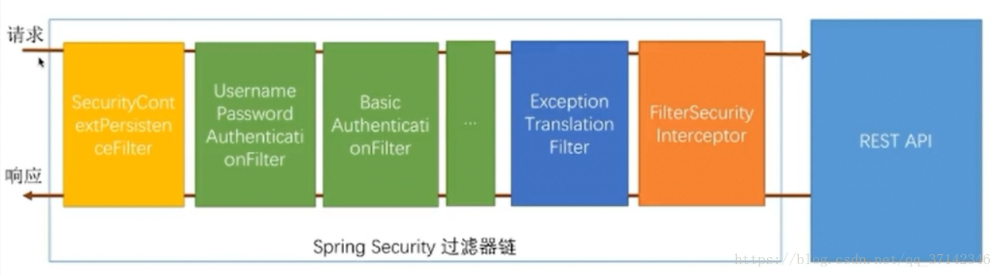
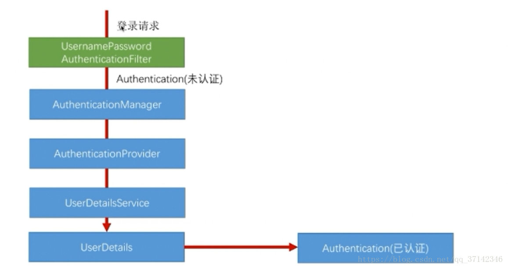
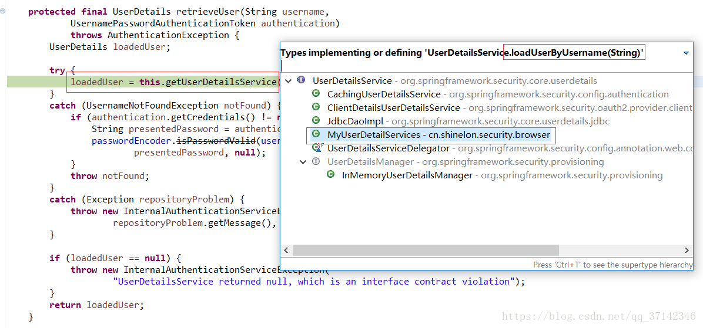
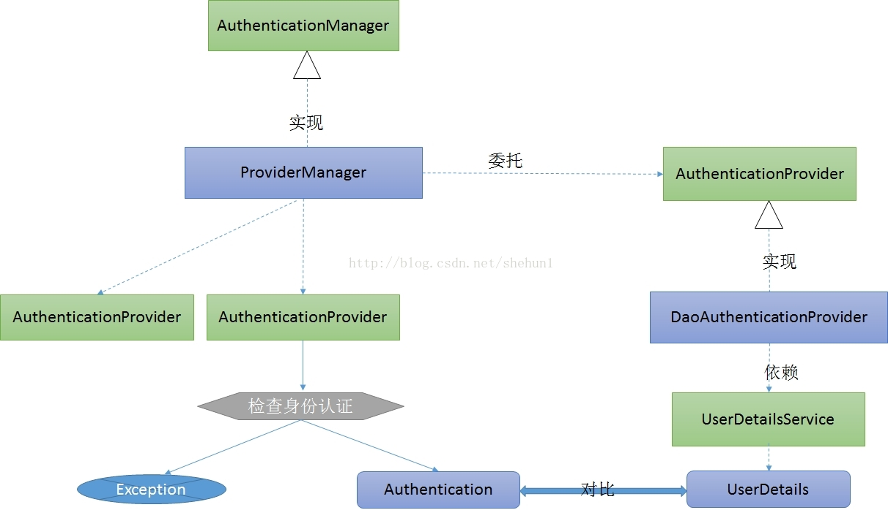
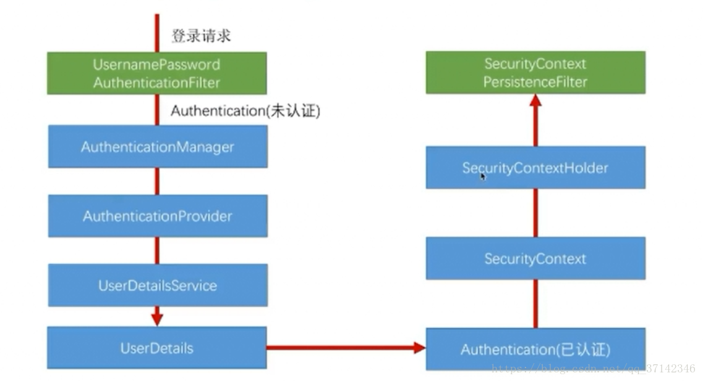

### Spring Security用户认证流程源码详解

本篇文章主要围绕下面几个问题来深入源码：

1. 用户认证流程
2. 认证结果如何在多个请求之间共享
3. 获取认证用户信息

####一、用户认证流程
Spring Security核心就是一系列的过滤器链，当一个请求来的时候，首先要通过过滤器链的校验，校验通过之后才会访问用户各种信息。 

这里要说明的是在过滤器的最前端有一个SecurityContextPersistenceFilter，当请求进来和返回的时候都会经过这个过滤器，它主要存放用户的认证信息。这里先简单提一下，后面会详解。 



当用户发送`登录请求`的时候，首先进入到UsernamePasswordAuthenticationFilter中进行校验。 



打断点发送登录请求进入源码中，我们会发现它会进入到UsernamePasswordAuthenticationFilter，在该类中，有一个attemptAuthentication方法在这个方法中，会获取用户的username以及password参数的信息，然后使用构造器new UsernamePasswordAuthenticationToken(username, password)封装为一个UsernamePasswordAuthenticationToken对象，在这个构造器内部会将对应的信息赋值给各自的本地变量，并且会调用父类AbstractAuthenticationToken构造器（这个父类的构造器后面会介绍到），传一个null值进去，为什么是null呢？因为刚开始并没有认证，因此用户没有任何权限，并且设置没有认证的信息（setAuthenticated(false)），最后会进入AuthenticationManager接口的实现类ProviderManager中。

```java
public Authentication attemptAuthentication(HttpServletRequest request,
			HttpServletResponse response) throws AuthenticationException {
		if (postOnly && !request.getMethod().equals("POST")) {
			throw new AuthenticationServiceException(
					"Authentication method not supported: " + request.getMethod());
		}

		String username = obtainUsername(request);
		String password = obtainPassword(request);

		if (username == null) {
			username = "";
		}

		if (password == null) {
			password = "";
		}

		username = username.trim();

		UsernamePasswordAuthenticationToken authRequest = new UsernamePasswordAuthenticationToken(
				username, password);

		// Allow subclasses to set the "details" property
		setDetails(request, authRequest);

		return this.getAuthenticationManager().authenticate(authRequest);
	}

```

```java
public UsernamePasswordAuthenticationToken(Object principal, Object credentials) {
		super(null);
		this.principal = principal;
		this.credentials = credentials;
		setAuthenticated(false);
	}
```

在ProviderManager这个实现类中，它会调用AuthenticationProvider接口的实现类获取用户的信息，用户的信息权限的验证就在该类中校验。进入ProviderManager类中调用authenticate(Authentication authentication)方法，它通过AuthenticationProvider实现类获取用户的登录的方式后会有一个for循环遍历它是否支持这种登录方式，具体的登录方式有表单登录，qq登录，微信登录等。如果都不支持它会结束for循环，如果支持则会进入AuthenticationProvider接口的抽象实现类AbstractUserDetailsAuthenticationProvider中调用 authenticate(Authentication authentication)方法对用户的身份进入校验。 

```java
public Authentication authenticate(Authentication authentication)
			throws AuthenticationException {
		Class<? extends Authentication> toTest = authentication.getClass();
		AuthenticationException lastException = null;
		Authentication result = null;
		boolean debug = logger.isDebugEnabled();
		// 获取用户的登录方式
		for (AuthenticationProvider provider : getProviders()) {
			if (!provider.supports(toTest)) {
				continue;
			}

			if (debug) {
				logger.debug("Authentication attempt using "
						+ provider.getClass().getName());
			}

			try {
                // 使用对应登录方式的认证逻辑
				result = provider.authenticate(authentication);
				// 只要有一种认证逻辑通过了就不再认证
				if (result != null) {
					copyDetails(authentication, result);
					break;
				}
			}
            .....
```

进入抽象类AbstractUserDetailsAuthenticationProvider的内部的authenticate方法之后，先会判断user是否为空，这个user是UserDetail的对象，如果为空，表示还没有认证，就需要调用retrieveUser方法去获取用户的信息，这个方法是抽象类AbstractUserDetailsAuthenticationProvider的扩展类DaoAuthenticationProvider的一个方法。 

```java
public Authentication authenticate(Authentication authentication)
			throws AuthenticationException {
		Assert.isInstanceOf(UsernamePasswordAuthenticationToken.class, authentication,
				messages.getMessage(
						"AbstractUserDetailsAuthenticationProvider.onlySupports",
						"Only UsernamePasswordAuthenticationToken is supported"));

		// Determine username
		String username = (authentication.getPrincipal() == null) ? "NONE_PROVIDED"
				: authentication.getName();

		boolean cacheWasUsed = true;
		UserDetails user = this.userCache.getUserFromCache(username);

		if (user == null) {
			cacheWasUsed = false;

			try {
				user = retrieveUser(username,
						(UsernamePasswordAuthenticationToken) authentication);
			}
			catch (UsernameNotFoundException notFound) {
                ......
      try {
			preAuthenticationChecks.check(user);
      // 通过用户名获取到用户后，在这里判断用户输入的密码和数据库密码是否一致
			additionalAuthenticationChecks(user,
					(UsernamePasswordAuthenticationToken) authentication);
		  }
		     .......        
       return createSuccessAuthentication(principalToReturn, authentication, user);
   }
```

在该扩展类的retrieveUser方法中调用UserDetailsService这个接口的实现类的loadUserByUsername方法去获取用户信息，而这里我自己编写了实现类MyUserDetail类，在这个实现类中，我们可以编写自己的逻辑，从数据库中获取用户密码等权限信息返回。 



```java
@Component
public class MyUserDetailsService implements UserDetailsService {

    @Autowired
    private UserRepository userRepository;

    @Override
    public UserDetails loadUserByUsername(String username) {
        User user = userRepository.findByUsername(username);
        if (user == null) {
            throw new UsernameNotFoundException(username);
        }
        return new MyUserPrincipal(user);
    }
}
```

注意：@Component这个注解需要定义，否则在上面代码中不会使用我们自定义的获取UserDetail的方式，而是使用默认的获取方式，根据springboot约定优于配置原则，自定义便不再使用默认配置。

在拿到用户的信息后，返回到AbstractUserDetailsAuthenticationProvider类中调用createSuccessAuthentication(principalToReturn, authentication, user)方法，在该方法中会调用三个参数的UsernamePasswordAuthenticationToken构造器，不同于前面调用两个参数的，因为这里已经验证了用户的信息和权限，因此不再是给父类构造器中传null值了，而是用户的权限集合，并且设置认证通过（setAuthenticated(true)）

```java
protected Authentication createSuccessAuthentication(Object principal,
			Authentication authentication, UserDetails user) {
		// Ensure we return the original credentials the user supplied,
		// so subsequent attempts are successful even with encoded passwords.
		// Also ensure we return the original getDetails(), so that future
		// authentication events after cache expiry contain the details
		UsernamePasswordAuthenticationToken result = new UsernamePasswordAuthenticationToken(
				principal, authentication.getCredentials(),
				authoritiesMapper.mapAuthorities(user.getAuthorities()));
		result.setDetails(authentication.getDetails());

		return result;
	}
```

```java
public UsernamePasswordAuthenticationToken(Object principal, Object credentials,
			Collection<? extends GrantedAuthority> authorities) {
		super(authorities); //调用父类检查权限
		this.principal = principal;
		this.credentials = credentials;
		super.setAuthenticated(true); // must use super, as we override
	}
```

在UsernamePasswordAuthenticationToken的父类中，它会检查用的权限，如果有一个为null，表示权限没有相应的权限，抛出异常。 

```java
public AbstractAuthenticationToken(Collection<? extends GrantedAuthority> authorities) {
   if (authorities == null) {
      this.authorities = AuthorityUtils.NO_AUTHORITIES;
      return;
   }

   for (GrantedAuthority a : authorities) {
      if (a == null) {
         throw new IllegalArgumentException(
               "Authorities collection cannot contain any null elements");
      }
   }
   ArrayList<GrantedAuthority> temp = new ArrayList<GrantedAuthority>(
         authorities.size());
   temp.addAll(authorities);
   this.authorities = Collections.unmodifiableList(temp);
}
```

然后在createSuccessAuthentication方法返回后回到ProvioderManager的authenticate方法中返回result，最后回到UsernamePasswordAuthenticationFilter的刚开始进入的attemptAuthentication方法中返回。 

`return this.getAuthenticationManager().authenticate(authRequest);`

通过上面的源码我们已经深入源码了解到用户的具体认证流程。这里简单总结一下，首先当用户发送请求的时候，会进入到UsernamePasswordAuthenticationFilter中得到一个UsernamePasswordAuthenticationToken，它其实相当于一个令牌，不过还没有经过认证，然后调用AuthenticationManager的实现类ProviderManager中判断登录方式是否支持，如果支持，则会调用AuthenticationProvider接口的抽象实现类AbstractUserDetailsAuthenticationProvider中调用它的扩展类DaoAuthenticationProvider中获取我们自己实现的MyUserDetails类获取用户密码进行用户身份验证，然后返回该对象，设置UsernamePasswordAuthenticationToken这个令牌认证通过，用户身份校验成功。

最后附上整个认证过程的结构图



#### 二、认证结果如何在多个请求之间共享

下面我们来看看用户在通过身份校验之后，是如何将认证结果在多个请求中共享的呢？肯定是放入session当中的。先来看看流程图。 



身份认证成功后，最后在UsernamePasswordAuthenticationFilter返回后会进入一个AbstractAuthenticationProcessingFilter类中调用successfulAuthentication方法中，这个方法最后会返回我们自己定义的登录成功处理器handler，在返回之前，它会调用SecurityContext，最后将认证的结果放入SecurityContextHolder中，SecurityContext类很简单，重写了equals方法和hascode方法，保证了authentication的唯一性。SecurityContextHolder类实际上对ThreadLocal的一个封装，可以在不同方法之间进行通信，我们可以简单理解为线程级别的一个全局变量。因此可以在同一个线程中的不同方法中获取到认证信息。最后会被SecurityContextPersistenceFilter过滤器使用，这个过滤器的作用是什么呢？当一个请求来的时候，它会将session中的值传入到该线程中，当请求返回的时候，它会判断该请求线程是否有SecurityContext，如果有它会将其放入到session中，因此保证了请求结果可以在不同的请求之间共享。 

这里建议看源码：AbstractAuthenticationProcessingFilter

由于太长我贴一个裁剪版

```java
package org.springframework.security.web.authentication;
public abstract class AbstractAuthenticationProcessingFilter extends GenericFilterBean
		implements ApplicationEventPublisherAware, MessageSourceAware {

	protected ApplicationEventPublisher eventPublisher;
	protected AuthenticationDetailsSource<HttpServletRequest, ?> authenticationDetailsSource = new WebAuthenticationDetailsSource();
	private AuthenticationManager authenticationManager;
	protected MessageSourceAccessor messages = SpringSecurityMessageSource.getAccessor();
	private RememberMeServices rememberMeServices = new NullRememberMeServices();

	private RequestMatcher requiresAuthenticationRequestMatcher;

	private boolean continueChainBeforeSuccessfulAuthentication = false;

	private SessionAuthenticationStrategy sessionStrategy = new NullAuthenticatedSessionStrategy();

	private boolean allowSessionCreation = true;

	private AuthenticationSuccessHandler successHandler = new SavedRequestAwareAuthenticationSuccessHandler();
	private AuthenticationFailureHandler failureHandler = new SimpleUrlAuthenticationFailureHandler();

	// ~ Constructors
	// ===================================================================================================

	/**
	 * @param defaultFilterProcessesUrl the default value for <tt>filterProcessesUrl</tt>.
	 */
	protected AbstractAuthenticationProcessingFilter(String defaultFilterProcessesUrl) {
		setFilterProcessesUrl(defaultFilterProcessesUrl);
	}

	/**
	 * Creates a new instance
	 *
	 * @param requiresAuthenticationRequestMatcher the {@link RequestMatcher} used to
	 * determine if authentication is required. Cannot be null.
	 */
	protected AbstractAuthenticationProcessingFilter(
			RequestMatcher requiresAuthenticationRequestMatcher) {
		Assert.notNull(requiresAuthenticationRequestMatcher,
				"requiresAuthenticationRequestMatcher cannot be null");
		this.requiresAuthenticationRequestMatcher = requiresAuthenticationRequestMatcher;
	}

	// ~ Methods
	// ========================================================================================================

	@Override
	public void afterPropertiesSet() {
		Assert.notNull(authenticationManager, "authenticationManager must be specified");
	}

	public void doFilter(ServletRequest req, ServletResponse res, FilterChain chain)
			throws IOException, ServletException {

		HttpServletRequest request = (HttpServletRequest) req;
		HttpServletResponse response = (HttpServletResponse) res;

		if (!requiresAuthentication(request, response)) {
			chain.doFilter(request, response);

			return;
		}

		if (logger.isDebugEnabled()) {
			logger.debug("Request is to process authentication");
		}

		Authentication authResult;

		try {
		    //  这里尝试进行用户认证，也就是上面所有的用户认证流程
			authResult = attemptAuthentication(request, response);
			if (authResult == null) {
				// return immediately as subclass has indicated that it hasn't completed
				// authentication
				return;
			}
			sessionStrategy.onAuthentication(authResult, request, response);
		}
		catch (InternalAuthenticationServiceException failed) {
			logger.error(
					"An internal error occurred while trying to authenticate the user.",
					failed);
			// 认证失败处理，可自定义		
			unsuccessfulAuthentication(request, response, failed);

			return;
		}
		catch (AuthenticationException failed) {
			// 认证失败处理，可自定义		
			unsuccessfulAuthentication(request, response, failed);

			return;
		}

		// Authentication success
		if (continueChainBeforeSuccessfulAuthentication) {
			chain.doFilter(request, response);
		}

		successfulAuthentication(request, response, chain, authResult);
	}

	
	protected boolean requiresAuthentication(HttpServletRequest request,
			HttpServletResponse response) {
		return requiresAuthenticationRequestMatcher.matches(request);
	}

	
	public abstract Authentication attemptAuthentication(HttpServletRequest request,
			HttpServletResponse response) throws AuthenticationException, IOException,
			ServletException;


	protected void successfulAuthentication(HttpServletRequest request,
			HttpServletResponse response, FilterChain chain, Authentication authResult)
			throws IOException, ServletException {

		if (logger.isDebugEnabled()) {
			logger.debug("Authentication success. Updating SecurityContextHolder to contain: "
					+ authResult);
		}
		// 将认证结果存储在session中
		SecurityContextHolder.getContext().setAuthentication(authResult);
		// 是否开启记住我功能
		rememberMeServices.loginSuccess(request, response, authResult);

		// Fire event
		if (this.eventPublisher != null) {
			eventPublisher.publishEvent(new InteractiveAuthenticationSuccessEvent(
					authResult, this.getClass()));
		}
		// 认证成功处理 可自定义
		successHandler.onAuthenticationSuccess(request, response, authResult);
	}

	protected void unsuccessfulAuthentication(HttpServletRequest request,
			HttpServletResponse response, AuthenticationException failed)
			throws IOException, ServletException {
		SecurityContextHolder.clearContext();

		if (logger.isDebugEnabled()) {
			logger.debug("Authentication request failed: " + failed.toString(), failed);
			logger.debug("Updated SecurityContextHolder to contain null Authentication");
			logger.debug("Delegating to authentication failure handler " + failureHandler);
		}

		rememberMeServices.loginFail(request, response);

		failureHandler.onAuthenticationFailure(request, response, failed);
	}
```

####三、获取认证用户信息

如果我们需要获取用的校验过的所有信息，该如何获取呢？上面我们知道了会将校验结果放入session中，因此，我们可以通过session获取。

```java
@GetMapping("/me")
public Object getMeDetail() {
    return SecurityContextHolder.getContext().getAuthentication();
}
```
```java
@GetMapping("/me1")
    public Object getMeDetail(Authentication authentication){
        return authentication;
    }
```

如果我们只想获取用户名和密码以及它的权限，不需要ip地址等太多的信息可以使用下面的方式来获取信息。

```java
@GetMapping("/me2")
    public Object getMeDetail(@AuthenticationPrincipal UserDetails userDetails){
        return userDetails;
    }
```

至此，本文深入源码了解到了Spring Seucrity的认证流程，以及认证结果如何在多个请求之间共享的问题。也许上面的内容看的不是很清楚，你可以结合源码来解读，自己看一看源码Spring Security的认证流程会更加清晰。

推荐博文：

- [Spring Security用户认证流程源码详解](<https://blog.csdn.net/qq_37142346/article/details/80032336>)